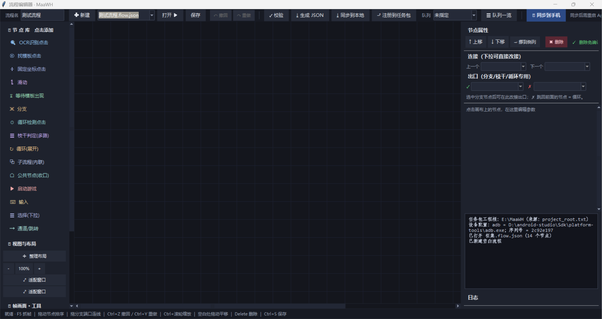

# MaaWH Studio —— 流程编辑器工作目录



可视化流程编辑器 + 模板框选工具。2026-09-14 从 `E:\MaaWH\FlowEditor\` 独立出来，
以后**流程编辑器相关的改动都在本目录进行**，MaaWH 仓库只保留 App 与任务包。

## 目录内容

| 文件/目录 | 作用 |
|---|---|
| `flow_editor.py` | 流程编辑器主程序：拖拽节点 → 连线 → 生成 `VF_*` pipeline → 一键同步手机 |
| `template_picker.py` | 模板框选工具 v2：拖框 + 负样本校验 + 建议阈值 |
| `import_pipelines.py` | 把 MaaWH 里手写的成熟 pipeline 反向导入成 `.flow.json` |
| `启动.bat` | 双击启动流程编辑器（等同桌面快捷方式） |
| `框选模板.bat` | 单独启动模板框选工具 |
| `flows/*.flow.json` | **流程定义（唯一数据源，要备份/入库）** |
| `flows/build/` | 生成的 pipeline JSON（可重新生成，不入库） |
| `project_paths.py` | 工程根探测（下面的「路径规则」） |
| `project_root.txt` | 手工指定 MaaWH 仓库路径（第一行有效路径生效） |
| `pick_frame.jpg` | 最近抓的帧，作为编辑器背景与框选工具的默认帧 |
| `*.log` / `recent.txt` | 运行日志与最近打开记录，可随时删 |

## 运行

```
双击 启动.bat          # 或桌面「流程编辑器」快捷方式
python flow_editor.py --selftest    # 无 GUI 自检（校验生成逻辑 + 打印工程根）
python template_picker.py 帧图.jpg   # 单独框选模板
```

依赖：`opencv-python`、`Pillow`（pythonw 在 `D:\python\pythonw.exe`）。

## 路径规则（重要）

本目录**不再**靠「上一级目录」找任务包，而是由 `project_paths.py` 按顺序探测 MaaWH 工程根：

1. 环境变量 `MAAWH_ROOT`
2. 本目录 `project_root.txt` 里第一条有效路径（**该文件第一行是注释说明，路径写在第二行**，现为 `E:\MaaWH`）
3. 兄弟目录 / 上级目录中含 `whmx/image` 的那个（两目录并排时自动命中）
4. 默认位置 `E:\MaaWH`、`D:\MaaWH`

用的都是同一套常量：`PROJECT_ROOT`/`IMG_DIR`/`NEG_DIR`，编辑器与框选工具共享。

- MaaWH 仓库**搬家或改名**后，改 `project_root.txt` **第二行**的路径（别删第一行注释，它也在说明这个规则），或设 `MAAWH_ROOT` 环境变量；同时本文档本节里举的示例路径要一起改（例如目录改名成 `MaaWH-repo` 时，这两处都得跟着动）。
- 探测失败时：编辑器启动日志会打 `⚠ 未找到 MaaWH 任务包…`，框选工具弹窗提示；此时模板图/生成物写不出去。

## 与 MaaWH 仓库的交界（写出去的东西）

| 方向 | 路径 | 说明 |
|---|---|---|
| 模板图 → MaaWH | `whmx/image/*.png` | 框选工具保存的模板，pipeline 直接引用 |
| 负样本 ← MaaWH | `_tools/neg_frames/` | 由 MaaWH 的 `_tools/pick.sh` 抓帧时累积（**不在本仓库，克隆后为空**，见下） |
| 生成物 → MaaWH | `whmx/pipeline/vf_*.json` | 「生成并同步」时回写一份，供打包/集成（**不随仓库交付**，见下） |
| 生成物 → 手机 | `files/taskpacks/whmx/pipeline/` | adb `run-as` 推送，App 重启后生效 |
| 注册到手机 | `files/taskpacks/whmx/interface.json` | 注册成【小工具】直达入口 `VF_<流程名>` |

手机上运行走宿主入口：`adb shell am start -n com.maawh.app/.MainActivity --es entry VF_<流程名> --ez vd true`。

### 克隆本仓库后拿不到的东西（两个仓库各自独立入库）

下面两样都存放在 **MaaWH 仓库侧**，且被 MaaWH 的 `.gitignore` 忽略，所以克隆任何一个仓库都不会带着它们：

- **负样本库 `_tools/neg_frames/`**：由 MaaWH 的 `_tools/pick.sh` 抓帧时顺带累积。新机器上它是空的，此时框选工具的「负样本最高分」没有参考值，**模板区分度无从判断**——先跑几次 `pick.sh`（或把已有的历史帧拷进去）把库养起来，再框选模板。
- **生成物 `whmx/pipeline/vf_*.json`**：**不随仓库交付**。注意编辑器里点「生成」只会写本目录 `flows/build/vf_<名>.json`；想让 MaaWH 侧出现 `vf_*.json`（打包和推手机都依赖它），必须点**「生成并同步」**——该动作除生成外还会推手机、更新模板图、注册【小工具】清单，因此需要连着设备。

## 注意

- 编辑器运行中别删本目录文件（`recent.txt`、日志会被写）。
- 流程定义只在 `flows/*.flow.json`；`flows/build/` 与 `whmx/pipeline/vf_*.json` 都是产物，改了源头要重新生成。
- App 覆盖安装 / force-stop 会连带虚拟屏一起没，跑流程前先重跑【启动】任务。
