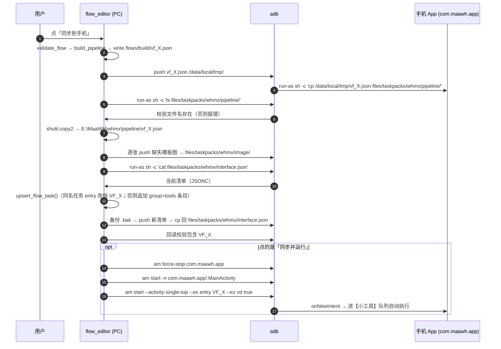
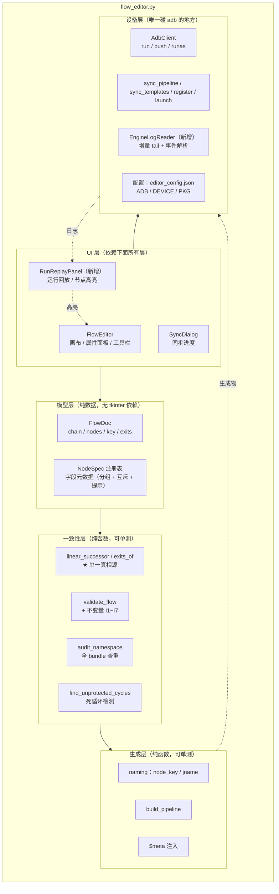
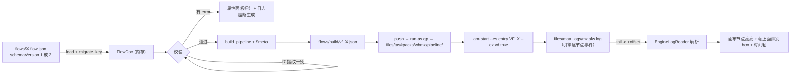
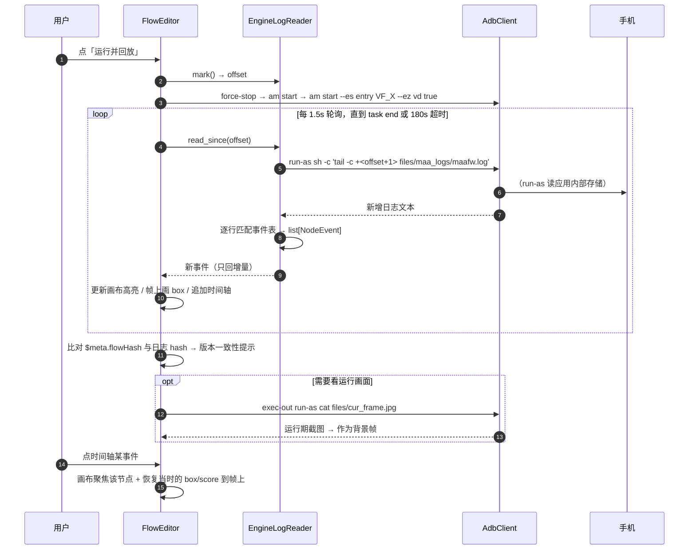
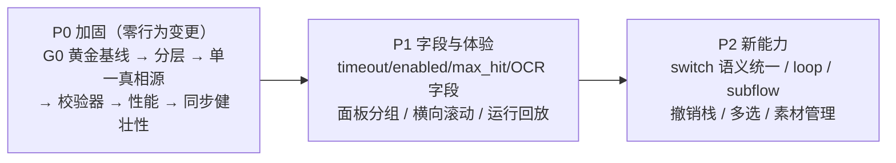

# MaaWH Studio 架构诊断与优化方案

> 对象：`E:\MaaWH Stdio`（PC 端可视化流程编辑器 / 模板框选工具 / 流程定义）
> 关联：`E:\MaaWH`（安卓端 App + 任务包 `whmx/`，本次**只读不改**）
> 日期：2026-09-14
> 原则：先读代码后评估；每条结论标注证据来源；不确定处标注「未确认」，不编造。

---

## 0. 阅读范围与证据基线

### 0.1 实际读到的文件

| 文件 | 行数/大小 | 说明 |
|---|---|---|
| `flow_editor.py` | 2673 行 | 主程序：节点模型 + 校验/生成器 + tkinter GUI + adb 同步 |
| `template_picker.py` | 363 行 | 模板框选工具 v2（负样本校验 + 建议阈值） |
| `import_pipelines.py` | 246 行 | pipeline → `.flow.json` 反向导入器 |
| `project_paths.py` | 87 行 | 任务包工程根探测 |
| `README.md` / `project_root.txt` / `.gitignore` / `启动.bat` / `框选模板.bat` | — | 文档与启动脚本 |
| `flows/*.flow.json` | 16 个流程定义 | 唯一数据源（入库） |
| `flows/build/*.json` | 10 个生成物 | 编辑器产物（不入库） |
| `E:\MaaWH\whmx\interface.json` | — | PI v2 声明式清单（含 `VF_*` 入口） |
| `E:\MaaWH\whmx\pipeline\{common,grind,zhengji,pqgs,libao,qiandao,login,cdzb,test_migrate}.json` | 261 个节点 | 手写成熟 pipeline（读作对照） |
| `E:\MaaWH\whmx\default_pipeline.json` | — | 引擎全局默认值 |
| `E:\MaaWH\AGENTS.md` | 269 行 | 安卓侧交接文档（同步通道的权威描述） |
| `E:\MaaWH\MaaFramework\docs\zh_cn\3.1-任务流水线协议.md` | 1637 行 | **Pipeline 协议权威来源** |
| `E:\MaaWH\MaaFramework\docs\zh_cn\3.3-ProjectInterfaceV2协议.md` | — | PI v2 / `focus` 节点通知机制 |
| `E:\MaaWH\MaaFramework\source\MaaFramework\Resource\PipelineResMgr.cpp` | — | 节点加载/重名检测（**关键证据**） |
| `E:\MaaWH\MaaFramework\source\MaaFramework\Vision\VisionTypes.h` | — | `OCRerParam::kDefaultThreshold = 0.3` 等默认值 |

### 0.2 实测证据（本次会话真机/真代码验证过，非推测）

| 编号 | 证据 | 获取方式 |
|---|---|---|
| E1 | 设备在线：`2c92e197 device`；`run-as com.maawh.app` 可用（当前装机为**可调试**版本） | `adb devices` / `adb -s 2c92e197 shell run-as ... ls files/taskpacks/whmx/pipeline/` |
| E2 | 手机端引擎日志 `files/maa_logs/maafw.log` 可读，含**逐节点结构化事件**（`Node.Recognition.Succeeded` / `Node.NextList.Failed` / `Task timeout [pretask.name=...]` / `TemplateMatcher ... [best_result_={...score}]`） | `adb exec-out run-as com.maawh.app cat files/maa_logs/maafw.log` |
| E3 | `tail -c +<offset>` 在设备上可用 → 可实现增量拉取日志 | 同上 |
| E4 | 引擎实际采用的默认值：`{"Default":{"duration...}}` → `timeout: 90000, rate_limit: 1200, pre_delay: 300, post_delay: 400`，`TemplateMatch: {threshold: 0.8, method: 5}` | 日志中 `DefaultPipelineMgr::load [json=...]` |
| E5 | 重名节点会导致**整包加载失败**：`if (existing_keys.contains(key)) { LogError << "key already exists"; return false; }`，且 `existing_keys` 在 `load_all_json` 内**跨全部文件共享** | `PipelineResMgr.cpp:175`、`:70` |
| E6 | `$` 开头的 JSON 根字段被跳过：`kNodePrefix_Ignore = "$"` | `PipelineTypes.h:362`、`PipelineResMgr.cpp:175` |
| E7 | OCR 字段 `text` 为**已废弃**别名（`// 已废弃字段，兼容一下`），正式字段是 `expected`；OCR `threshold` 默认 **0.3** | `PipelineParser.cpp:672`、`VisionTypes.h:79` |
| E8 | switch 候选内容节点被剥离 `next`（后继节点静默不可达）；branch 内容节点保留 `next`（语义不一致） | 本次实测 `build_pipeline` 输出，见附录 A.1 |
| E9 | `{角色}.png` 这类占位符模板会被当成缺失模板报硬错误 | 本次实测，见附录 A.2 |
| E10 | 节点名是**位置化**的（`VF_<流程名>_<链序号>`），重排链顺序即改全部节点名/语义 | 本次实测，见附录 A.3 |
| E11 | `tap`/`swipe`/`startapp`/`common` 不写 `timeout` → 继承 90000ms | 本次实测，见附录 A.4 |
| E12 | 带背景帧时 `redraw()` 约 **22~23 ms/帧**（36~40 节点）；不带背景帧约 6~9 ms/帧 | tkinter 真机基准，见附录 A.5 |
| E13 | 全局快捷键只有 3 个（F5 / Ctrl+S / Delete）；无缩放、撤销重做、复制粘贴、右键菜单、多选 | `grep bind(` 审计 |
| E14 | 无横向滚动：`canvas` 仅绑 `<MouseWheel>` → `yview_scroll`，无 `xscrollcommand` | `flow_editor.py:1435-1436`、`:1150` |

---

## 1. 项目探索摘要

### 1.1 技术栈与架构

**单进程 Python 桌面程序，无框架、无构建、无测试框架。**

| 维度 | 现状 |
|---|---|
| 语言/运行时 | Python 3.12（`D:\python`，`pythonw.exe` 无控制台启动） |
| GUI | 标准库 `tkinter` / `ttk`，自绘 Canvas（`create_polygon(smooth=True)` 画圆角卡片） |
| 图像 | `Pillow`（`ImageTk` 显示帧与模板缩略图）、`opencv-python`（`template_picker` 匹配校验） |
| 依赖管理 | 无 `requirements.txt` / `pyproject.toml`，仅 README 口头说明 |
| 测试 | 无 pytest；`python flow_editor.py --selftest` 是内置断言脚本（含 GUI 烟测） |
| 版本控制 | 独立 git 仓库，首次提交 `77c8b32`，工作区干净 |
| 代码规模 | `flow_editor.py` 2673 行单文件，**无包结构、无模块拆分** |

架构上是一个**三段线性管道**：

```
flows/*.flow.json  ──(validate_flow)──> 校验
                   ──(build_pipeline)──> MaaFramework pipeline dict
                   ──(write_pipeline_json)──> flows/build/vf_*.json
                   ──(sync_pipeline_file / sync_templates / register_on_phone / launch_on_phone)──> 手机
```

其中 `validate_flow` 与 `build_pipeline` 是**纯函数**（`flow_editor.py:323-640`），GUI 与 adb 都在其后。这个「核心生成逻辑与 GUI 解耦」是全项目最正确的设计决策，也是后续所有升级的落脚点——**新引擎可以完全不动 GUI 就替换掉**。

### 1.2 目录结构与模块划分

```
E:\MaaWH Stdio\
├─ flow_editor.py          # 主程序（节点模型 + 校验/生成 + GUI + adb 同步）  ← 唯一需要大改的文件
├─ template_picker.py      # 模板框选（负样本校验、建议阈值）
├─ import_pipelines.py     # 手写 pipeline → .flow.json 反向导入（一次性迁移工具）
├─ project_paths.py        # 工程根探测（唯一「配置」入口）
├─ project_root.txt        # 手工指定 MaaWH 路径（第 2 行有效）
├─ flows/*.flow.json       # 流程定义 —— 唯一数据源
├─ flows/build/            # 生成物（不入库）
├─ pick_frame.jpg          # 最近抓帧（编辑器背景 + 框选工具默认帧）
├─ recent.txt / *.log      # 运行状态
└─ 启动.bat / 框选模板.bat
```

**模块划分实际上只存在于函数命名前缀里**：`_build_*`（UI 布局）、`on_*`（事件）、`_draw_*`（绘制）、`_make_*`（控件工厂）、`_sync_*`（同步）。没有 `models.py` / `graph.py` / `generator.py` / `device.py` 的物理拆分。

与 MaaWH 仓库的交界**只有四处**（`AGENTS.md:53-58` 已明文约束）：

1. 写模板图 → `whmx/image/*.png`
2. 读负样本 ← `_tools/neg_frames/`
3. 回写生成物 → `whmx/pipeline/vf_*.json`
4. 推手机 → `files/taskpacks/whmx/{pipeline,image,interface.json}`，入口 `--es entry VF_<流程名> --ez vd true`

### 1.3 当前已实现的节点类型和字段

`NODE_TYPES`（`flow_editor.py:159-278`）共 **9 种节点类型**，字段总计 **9 类控件类型**（`tpl_multi` / `common` / `bool` / `float` / `int` / `str` / `roi` / `pick` / `pick2` / `switch_list`）。

| 节点类型 | 标签 | 生成 recognition | 生成 action | 暴露的字段 |
|---|---|---|---|---|
| `tpl_click` | 找模板点击 | `TemplateMatch` | `Click` | template(多候选) / threshold / roi / order_by(仅 Score 开关) / timeout / rate_limit / pre_delay / post_delay / repeat / repeat_delay / post_wait_freezes |
| `ocr_click` | OCR识别点击 | `OCR` | `Click` | text(旧字段) / roi / timeout / rate_limit / pre_delay / post_delay |
| `tap` | 固定坐标点击 | （无，DirectHit） | `Click` | x / y / pre_delay / post_delay / repeat / repeat_delay / post_wait_freezes |
| `swipe` | 滑动 | （无） | `Swipe` | x1,y1,x2,y2 / duration / repeat / repeat_delay / post_delay |
| `wait_tpl` | 等待模板出现 | `TemplateMatch` | `DoNothing` | template(多候选) / threshold / roi / timeout / rate_limit |
| `branch` | 分支(模板在?) | `TemplateMatch` 或 `OCR` | `DoNothing` | template / threshold / ocr_text / roi / timeout / rate_limit + 出口 `hit_next` / `miss_next` |
| `switch` | 枝干判定(多路) | `TemplateMatch` 或 `OCR`（级联） | `DoNothing` | candidates[{t,timeout,next}] / miss_next |
| `common` | 公共节点(收口) | （无） | （无，仅 `next`） | node（8 个 `Common_*` 白名单，只读下拉） |
| `startapp` | 启动游戏 | （无） | `StartApp` | package / post_delay |

**流程文件格式**（实测 `flows/喝茶.flow.json`）：

```jsonc
{
  "name": "喝茶",
  "chain": ["nrukou", "n00498da", ...],       // 线性主链，顺序即执行顺序
  "nodes": {
    "n00498da": {
      "type": "tpl_click", "x": 500, "y": 230, // x/y 是画布坐标，不是游戏坐标
      "title": "找模板点击",                    // UI 不可编辑，仅由类型默认值或导入器写入
      "props": { "template": "tea_0.png", "threshold": 0.8, ... }
    }
  }
}
```

出口只存在于两类节点上：`branch` 的顶层 `hit_next`/`miss_next`，`switch` 的 `props.candidates[i].next` 与 `props.miss_next`。**其余节点没有显式出口，出口 = `chain` 上的下一个。**

### 1.4 执行引擎工作方式

本项目**没有自己的执行引擎**——引擎是安卓端的 MaaFramework。编辑器只负责把 `chain` + 出口编译成扁平节点字典。编译规则（`build_pipeline`，`flow_editor.py:417-640`）：

```
VF_<流程名>            → {next: [VF_<名>_01]}                    入口（DirectHit）
VF_<名>_NN             → 该链序号节点的实体；NN 取 chain.index+1 两位
VF_<名>_NN_Hit         → branch/switch 的「判定命中」子节点
VF_<名>_NN_JK / _JK_Hit→ switch 第 K 个候选的级联容器与命中子节点
VF_<名>_End            → {action: DoNothing, next: []}           收口（miss 未连线时按需生成）
```

- **分支**编译为「分叉容器」模式：容器 `{DoNothing, timeout, next:[_Hit], on_error:[miss]}`，因为 `AGENTS.md:156` 记录了实测结论「`on_error` 只在容器节点生效」。
- **枝干**编译为级联：`J1.on_error=[J2] → J2.on_error=[J3] … → 末位.on_error=miss_ref`，命中走 `_Hit.next`。
- **`switch` 候选的内容起点被登记进 `switch_leaf` 集合，生成时剥离其 `next`**（`flow_editor.py:445-451`），作者注释说是「防分支内容串线」。
- 公共节点编译为 `{next: ["Common_回主页"]}`（无 recognition/action → 引擎默认 `DirectHit` + `DoNothing`，永远命中后跳转，不返回）。

关于引擎自身的执行语义（**权威来自 `MaaFramework/docs/zh_cn/3.1-任务流水线协议.md`，务必记住这两条**，因为编辑器的字段标签与之不符）：

1. **`timeout` 属于「本节点的 next 列表识别」的超时，不属于本节点的识别等待**。协议原文：「*如果你希望调整当前节点的 recognition 识别等待时间，就应该调整上一节点的 timeout 属性，而不是调整当前节点的。*」编辑器的 `tap` 节点标签写作「等待超时ms」，实际语义是「点完之后等下一个节点出现的最长时间」。
2. **`on_error` 的触发条件有两个**：next 列表整体超时，**或**命中节点的 action 执行失败。

### 1.5 画布与属性面板实现方式

**画布**：单个 `tk.Canvas`，每次 `redraw()` 执行 `canvas.delete("all")` 后全量重建（网格 → 背景帧 → 主链箭头 → 分支连线 → 节点卡片 → 出口标签 → 入口标记 → 拖线临时线）。滚动靠 `canvas.config(scrollregion=...)` + `<MouseWheel>` 改 `yview`。

**交互**：
- 拖节点：`on_motion` 改 `x/y` 并调用 `_reorder_on_drag`（按卡片中心 y 值 `bisect` 实时重排 `chain`）——即**「排序就是拖动」**。
- 连线：从节点右侧端口圆点拖到目标节点 `_set_wire` 写回 `hit_next`/`miss_next`/`candidates[i].next`。
- 取坐标：`_start_pick` → 在背景帧上点一下 → `_canvas_to_frame` 换算成帧坐标写入 `x/y`。
- 命中测试：`canvas.find_overlapping` + tag 前缀（`port:<nid>:<port>` / `node:<nid>`）。

**属性面板**：`build_prop_panel()` 每次选中节点就**销毁并重建全部字段控件**（`flow_editor.py:2046-2099`），按 `NODE_TYPES[type]["fields"]` 三元组列表动态渲染。这已经是「按节点类型动态渲染」的正确雏形，但字段集是**硬编码的三元组表**，没有分类、没有折叠、没有增删字段、没有多选批量编辑。

### 1.6 与安卓端同步的方式

同步链路**完全基于 adb + `run-as`**，无网络通道。



抓帧（预览/模板来源）走 `FrameSave` 三步（`AGENTS.md:80-85`）：

```
am start -n com.maawh.app/.MainActivity                        # 确保前台
am start ... --activity-single-top --es entry FrameSave        # 必须 single-top
sleep 5; exec-out run-as com.maawh.app cat files/cur_frame.jpg
```

`upsert_flow_task`（`flow_editor.py:757-779`）有一个**容易忽略的破坏性语义**：如果清单里已有同名任务，它会把该任务的 `entry` **改指向 `VF_<流程名>`**。也就是说，在编辑器里把一个流程命名为「派遣公司事务」并同步，会静默地把手上成熟任务 `派遣公司事务`（原本 entry 指向手写 pipeline）切换到编辑器生成版。目前 `E:\MaaWH\whmx\interface.json` 里已出现两个被这样转正的入口（`VF_每日免费礼包`、`VF_派遣公司事务`）。

### 1.7 我判断的主要问题与耦合点（结论先行）

**一句话结论**：生成器的「图模型」与 MaaFramework 的「图模型」不是同一个东西，中间靠 `chain` 线性链 + 位置化命名勉强映射；这套映射在简单流程上够用，但已经产生 4 个**静默错误**（不报错、生成结果与画布所见不一致），并且无法表达 MaaFramework 已有的 5 类关键能力（`enabled` / `max_hit` / `anchor` / `jump_back` / 组合识别）。同时，调试闭环的数据**已经全部躺在手机日志里**（证据 E2），只要把编辑器接上就能完成「日志回传 → 节点高亮 → 识别框可视化」，这是投入产出比最高的一步。

**耦合点清单**：

| # | 耦合点 | 位置 | 风险 |
|---|---|---|---|
| C1 | 节点名 = 位置（`chain.index+1`） | `jname()` `flow_editor.py:427-432` | 重排链 → 全部节点改名 → 任何外部引用（PI v2 `pipeline_override`、手写 pipeline 的 `next`）静默失效 |
| C2 | `switch_leaf` 是**全局节点 id 集合**，不区分上下文 | `flow_editor.py:445-451` | 一个节点既是被 switch 引用的内容、又是别处线性后继时，后继被静默截断（E8） |
| C3 | `branch` 与 `switch` 的分支语义不一致 | `flow_editor.py:450-457` vs `561-595` | branch 可回并主线、switch 不能；用户无法预测画布行为的差异 |
| C4 | `common` 节点忽略 `chain_next` | `flow_editor.py:597-598` | 链中间的公共节点之后所有节点不可达（只有一条 warn） |
| C5 | 硬编码 ADB 路径 / 设备号 / 包名，且在 2 个文件里重复 | `flow_editor.py:55-58`、`template_picker.py:44-46` | 换机/换 SDK 路径要改两处；多设备场景失效 |
| C6 | `whmx/pipeline/vf_*.json` 与 `flows/*.flow.json` 无版本指纹关联 | `write_pipeline_json` | 无法判断手机上跑的是不是当前流程版本；仓库里已有孤儿生成物（`vf_派遣公司事务完整版.json`、`vf_示例流程.json` 的源文件已删） |
| C7 | 编辑器对「全 bundle 节点命名空间」无感知 | `validate_flow` 只校验本流程 | 重名 → **整包加载失败**（E5），影响所有任务，不只是新流程 |
| C8 | `_syncing` 后台线程会读写 `self.flow` | `_sync_worker` `flow_editor.py:2478` | 工作线程调 `write_pipeline_json(self.flow)`、`sync_templates(self.flow)`，与主线程编辑构成数据竞争 |

---

## 2. 标杆工具设计要点汇总表

### 2.1 MaaFramework Pipeline 协议（权威基线）

> 来源：`E:\MaaWH\MaaFramework\docs\zh_cn\3.1-任务流水线协议.md`（1637 行）+ `source/MaaFramework/**` 源码。协议版本 v5.9。

#### 2.1.1 节点级（流程控制）字段全表

| 字段 | 类型 | 默认 | 语义要点 | 编辑器是否暴露 |
|---|---|---|---|---|
| `recognition` | string | `DirectHit` | 9 种取值：`DirectHit`/`TemplateMatch`/`FeatureMatch`/`ColorMatch`/`OCR`/`NeuralNetworkClassify`/`NeuralNetworkDetect`/`And`/`Or`/`Custom` | 仅 3 种 |
| `action` | string | `DoNothing` | 15 种取值，见 2.1.3 | 仅 4 种 |
| `next` | string \| NodeAttr \| list | 空 | **按顺序识别，只执行第一个命中的** | 隐式（=链上下一个） |
| `on_error` | 同上 | 空 | next 全部超时 **或 action 失败** 时进入 | 仅 branch/switch |
| `timeout` | int | 20s（本包覆盖为 **90s**） | **本节点 next 列表**的识别超时；`-1` = 无限等待 | 仅 4/9 种节点 |
| `rate_limit` | uint | 1000（本包 1200） | 每轮识别最低耗时，不足则 sleep | 仅 4/9 种节点 |
| `pre_delay` | uint | 200（本包 300） | 识别到→执行动作前 | 部分 |
| `post_delay` | uint | 200（本包 400） | 执行动作后→识别 next 前 | 部分 |
| `pre_wait_freezes` | uint \| object | 0 | 等画面静止（object 可配 `time`/`target`/`threshold`/`method`/`rate_limit`/`timeout`） | **否** |
| `post_wait_freezes` | uint \| object | 0 | 同上，动作后 | 仅 tpl_click/tap |
| `repeat` | uint | 1 | 动作重复次数；单次失败不中止，以最后一次为准 | 部分 |
| `repeat_delay` | uint | 0 | 重复间隔 | 部分 |
| `repeat_wait_freezes` | uint \| object | 0 | 重复前等画面静止 | **否** |
| `inverse` | bool | false | 反转识别结果（命中当未命中） | **否** |
| `enabled` | bool | true | false → 被 next 引用时**跳过**（既不识别也不执行） | **否** ← 影响调试开关能力 |
| `max_hit` | uint | UINT_MAX | 最多被识别成功次数，超出后跳过 | **否** ← 手写 `common.json` 已用它防死循环 |
| `anchor` | string \| list \| object | 空 | 命中并执行动作后**设置锚点**；object 形式可指定目标节点或清除（v5.7） | **否** |
| `focus` | object | null | 关注消息模板，键为 `Node.Recognition.Succeeded` 等，值含 `content`/`display`(`log`/`toast`/`notification`/`dialog`/`modal`)/`trace` | **否** ← 调试可视化入口 |
| `attach` | object | 空 | 附加配置，不影响执行，可被接口取回；与默认值 **dict merge** | **否** ← 元数据的合法落点 |
| `is_sub` / `interrupt` | — | — | **v5.1 已废弃**，用 `[JumpBack]` 替代 | 否 |

#### 2.1.2 导航机制：`next` / `on_error` 的三种 NodeAttr

| 模式 | 语法 | 语义（协议原文要点） | 编辑器 |
|---|---|---|---|
| Regular | `"NodeB"` | 普通候选，顺序尝试 | 支持 |
| JumpBack | `"[JumpBack]NodeC"` 或 `{name, jump_back:true}` | 该节点命中 → 执行其后续节点链 → **链执行完毕后回到父节点，重新从头尝试父节点的 next 列表**；**若处于 on_error 路径则不做回跳**（v5.9 修复了 action 失败时的不一致）。典型场景：处理网络断开/权限弹窗后回归主流程 | **不支持** |
| Anchor | `"[Anchor]X"` 或 `{name:"X", anchor:true}` | `name` 被当作**锚点名**解析为「最后设置该锚点的节点」；锚点未设置/已清除则**跳过该候选**。配合节点的 `anchor` 字段使用，可视为给 pipeline 引入变量机制 | **不支持** |

执行流程（协议原文）：
```
父节点顺序识别 next 中的节点 → 命中带 jump_back 的节点 → 执行该节点及其后续链
→ 链执行完毕（且不在 on_error 路径）→ 回到父节点，从 next 列表起始位置重新识别
```

#### 2.1.3 recognition / action 全取值与专属字段

| recognition | 主要专属字段 | 默认阈值 |
|---|---|---|
| `DirectHit` | `roi` / `roi_offset` | — （永远命中） |
| `TemplateMatch` | `template`(必选,可为**文件夹**) / `threshold`(可数组) / `order_by`(`Horizontal`\|`Vertical`\|`Score`\|`Random`) / `index`(-N..N-1) / `method`(10001\|3\|5) / `green_mask` | 0.7（本包 0.8，method 5） |
| `FeatureMatch` | `template`/`count`/`ratio`/`green_mask`/`detector`(SIFT/KAKAZE/AKAZE/BRISK/ORB) | — |
| `ColorMatch` | `method`/`lower`/`upper`/`count`/`connected`/`order_by` | — |
| `OCR` | **`expected`**（原 `text`，已废弃）/ `threshold`(置信度) / `replace` / `order_by`(含 `Expected`) / `index` / `only_rec` / `model` / **`color_filter`**(v5.8) | **0.3** |
| `NeuralNetworkClassify/Detect` | `model`/`labels`/`expected`/`order_by` | — |
| `And` / `Or` | `all_of` / `any_of`（列表元素可为节点名或内联对象，v5.7） | — |
| `Custom` | `custom_recognition` / `custom_recognition_param` | — |

| action | 主要专属字段 |
|---|---|
| `DoNothing` | — |
| `Click` / `LongPress` | `target`(true\|节点名\|[x,y]\|[x,y,w,h]) / `target_offset` / `contact` / `pressure` |
| `Swipe` | `begin`/`end`(可为列表=多点) / `begin_offset`/`end_offset` / `duration`(可列表) / `end_hold` / `only_hover` / `contact` / `pressure` |
| `MultiSwipe` | `swipes` 数组（多点同时滑动） |
| `Scroll` | `target`/`target_offset`/`dx`/`dy` |
| `TouchDown`/`TouchMove`/`TouchUp`/`KeyDown`/`KeyUp` | 底层事件（v5.0） |
| `ClickKey`/`LongPressKey` | `key`(虚拟键码，可列表) |
| `InputText` | `input_text` |
| `StartApp` | `package` / `exec` / `args` |
| `StopApp` | `package` |
| `StopTask` | — |
| `Command` / `Shell` | `exec`/`args`/`detach`；`Shell.timeout` → `shell_timeout`(v5.8) |
| `Screencap` | `filename`/`format`（v5.8 新增） |
| `Custom` | `custom_action` / `custom_action_param` |

动作时序（协议流程图，**顺序很重要**）：
```
进入节点 → pre_wait_freezes → pre_delay → action
        → [repeat>1] repeat_wait_freezes → repeat_delay → action …×（repeat-1）
        → post_wait_freezes → post_delay → 截图 → 识别 next
        → 命中:进入新节点 / 未命中:未超时→sleep(rate_limit) 继续 / 超时→on_error
```

#### 2.1.4 加载与命名空间规则（本项目最需要知道的三条）

1. **重名即致命**：`parse_and_override_once` 里 `existing_keys` 跨 `load_all_json` 的**所有文件**共享，命中重复键直接 `return false` → 该次资源加载整体失败。**没有「同名覆盖」语义**（证据 E5，`PipelineResMgr.cpp:70/175`）。
2. **`$` 前缀根字段被跳过**：`kNodePrefix_Ignore = "$"`（证据 E6）。这是往 pipeline JSON 里放元数据的**唯一零风险位置**。
3. **`.` 开头的目录/文件被跳过**（`kFilePrefix_Ignore = "."`），支持 `.json` / `.jsonc`（注释由 `json::open(path, true, true)` 开启）。

#### 2.1.5 PI v2 与编辑器相关的两点

- **`option` + `cases` + `pipeline_override`**：宿主只收集选项值，靠覆盖 `next`/`repeat`/`enabled`/`template` 实现参数化。`pipeline_override` 的**键是节点名**——这使 C1（位置化命名）从「可读性问题」升级为「功能性问题」：链一重排，`option` 就指向了别的节点。`E:\MaaWH\_tools\audit_interface.py` 会校验节点名存在性，是现有的兜底。
- **`focus` 节点通知**：`{"focus": {"Node.Action.Starting": {"content": "{name} 开始执行", "display": "toast"}}}`，`display` 取值 `log`/`toast`/`notification`/`dialog`/`modal`，支持数组。**当前安卓端 App 未绑定节点级回调**（`MaaBridge.kt` 无 `NodeNotification`/`EventCallback` 绑定，仅自定义控制器回调），所以 `focus` 目前不会被渲染——但**引擎日志里有完整的等价事件流**（证据 E2），PC 侧可以直接用。

#### 2.1.6 官方 JSON Schema（**可直接复用，无需手写**）

`E:\MaaWH\MaaFramework\tools\pipeline.schema.json`（174 KB，JSON Schema draft 2020-12）已把协议完全机器化：

```jsonc
{
  "$schema": "https://json-schema.org/draft/2020-12/schema",
  "patternProperties": { "^(?!\\$).*": { "$ref": "#/$defs/Node" } },  // 与引擎的 $ 前缀跳过规则一致
  "$defs": {
    // 每个识别/动作都有 V1/V2 两套定义
    "RecognitionEnum": {...}, "ActionEnum": {...},
    "TemplateMatch", "TemplateMatchV1", "TemplateMatchV2",
    "Ocr", "OcrV1", "OcrV2",
    "And", "Or", "SubRecognition", "SubRecognitionInline",
    "NodeAttr", "jsonNodeList", "jsonTarget", "jsonRoi", "jsonRect", "WaitFreezes",
    "Click", "LongPress", "Swipe", "MultiSwipe", "SwipeListItem",
    "TouchDown/Move/Up", "Scroll", "ClickKey", "LongPressKey", "InputText",
    "StartApp", "StopApp", "StopTask", "Command", "Shell", "Screencap",
    "CustomRecognition", "CustomAction", "Node"
  }
}
```

同目录还有 `interface.schema.json`（68 KB，PI v2）。**结论：编辑器的字段元数据应该从这两个 schema 生成，而不是继续维护 `NODE_TYPES` 三元组手写表。**

#### 2.1.7 MaaFramework 协议对本项目最相关的 10 条

| # | 结论 | 对本项目的影响 |
|---|---|---|
| 1 | 同一 Bundle 内节点名**必须全局唯一**，重名 = **整包加载失败**（不是覆盖） | `validate_flow` 必须升级为「全 bundle 命名空间查重」，否则一次失误废掉手机上的全部任务 |
| 2 | `$` 前缀根字段被跳过 | 元数据（流程指纹、生成时间、编辑器版本）的**零风险落点** |
| 3 | 官方 `pipeline.schema.json` 已完整 | 字段面板改为 schema 驱动，不再手写字段表 |
| 4 | 参数面板应按「算法/动作类型」动态切换专属字段 | 现在 `NODE_TYPES` 把识别+动作+流程字段混在一张平表里，是耦合根源 |
| 5 | `roi`/`target` 是**多态**（`true` / 节点名 / `[Anchor]` / `[x,y]` / `[x,y,w,h]`） | 属性面板需要一个「多态取址」控件组，而不是单纯的 `roi` 文本框 |
| 6 | `next` 是**有序候选列表**，顺序有语义 | 画布连线必须支持排序，并区分 `next` 与 `on_error` |
| 7 | `[JumpBack]`：执行完该节点链 → 回**父节点** → 从 next **头部**重扫；`on_error` 路径**不**回跳 | 编辑器完全不支持，且 UI 文案若要做必须写对 |
| 8 | `anchor` 是协议唯一的「伪变量」；`[Anchor]X` 未设置时**静默跳过**候选 | 需要独立的锚点视图 + 未设置锚点告警 |
| 9 | `timeout` 是**本节点 next 列表**的扫描超时；`timeout=0` ≈ 首轮失败即超时；`-1` = 无限 | 编辑器 `tap`/`swipe`/`startapp`/`common` 缺失该字段（E11），实际吃 90 s 默认值 |
| 10 | `focus` 是官方节点通知机制（`display: log/toast/notification/dialog/modal`） | 调试可视化的**标准出口**；当前 App 未绑定节点回调，但引擎日志有等价事件流（E2） |

### 2.2 MaaPipelineEditor（MPE）

> 调研状态：本节的**逐条来源核验**由并行调研完成；下面先给出与本项目直接可比的结论表，来源见 2.4 节末尾。凡未能核实的条目一律标注「未确认」。

MPE 是本项目最直接的对照物：同样是「把 MaaFramework pipeline 可视化」。公开资料描述的能力（`README` 与文档站口径）与本项目现状的差距：

| 能力维度 | MPE（公开描述） | MaaWH Studio 现状 | 差距性质 |
|---|---|---|---|
| 前端技术 | React + ReactFlow（专业图编辑器库） | tkinter Canvas 自绘 | **架构级**，非功能级 |
| 前后端 | 前后端分离 | 单进程桌面程序 | 本项目无需要 |
| 坐标持久化 | 需独立存放（ReactFlow 节点坐标不属于 pipeline 语义） | `flows/*.flow.json` 的 `x/y` | 本项目方案更清晰（定义与产物分离） |
| 节点样式 | 多节点样式 / 节点聚焦 | 9 种类型，左侧色条 + 图标 | 视觉信息密度接近 |
| 关键路径高亮 | 支持 | **不支持** | 可增量补 |
| 可拖拽连接中点 | 支持 | **不支持**（只有端点拖拽） | 可增量补 |
| 便签与分组 | 支持 | **不支持** | 可增量补 |
| 识别小工具 | 内置（模板截图/OCR 试跑等） | 有 `template_picker`（负样本校验是其亮点） | 本项目在**模板质量**上更强，在**覆盖率**上更弱 |
| 流程化调试 | 支持 | **完全没有** | **最大短板，也是最大机会**（证据 E2 使其实施成本很低） |
| 节点预制模板 | preset 系统 | 无（仅类型默认值） | 可增量补 |
| 旧项目导入 / 字段智能迁移 | 支持 | `import_pipelines.py`（功能更弱：无智能迁移、无字段映射表、跳过多候选） | 可增量补 |
| 布局 / 快捷键 | （未确认） | 无缩放/无撤销/无多选/3 个快捷键 | 需补 |

**本项目相对 MPE 的结构性差异**：MPE 直接编辑 pipeline（图就是 pipeline），本项目是「流程定义 → 编译 → pipeline」（图不是 pipeline）。后者**理论上更优**（可用高层节点表达意图），但代价是**编译器必须正确且可解释**——而这正是当前 4 个静默缺陷（E8/E9/E10/E11）的来源。所以本项目的升级重点不是「补图编辑器功能」，而是**先让编译器可信**，再补编辑体验。

### 2.3 MaaMeow / MaaFwApp

与 MaaFramework 协议（2.1）和本项目实际同步链路（1.6）比对后，本节只保留对本项目**有直接设计含义**的三条（其余为安卓端实现细节，本次不改安卓侧）：

| 主题 | 标杆做法 | 对本项目的含义 |
|---|---|---|
| 外部触发任务 | 通过 Intent extra（`--es entry <任务名>`）触发，配合 Macrodroid/Tasker 无人值守 | 本项目已用同一机制（`--es entry VF_<流程名> --ez vd true`），**这条链路不改**，见 4.6 的「保持不变」 |
| 任务包动态更新 | 任务包放应用内部存储，`run-as` 覆盖写文件即可热更新，无需重装 APK | 与 `AGENTS.md:92-93` 一致，本项目的 `sync_pipeline_file` 已符合 |
| 虚拟屏生命周期 | 虚拟屏挂在使用者进程，覆盖安装 / force-stop 即丢失，需重跑「启动」重建 | 解释了为什么编辑器的「同步并运行」必须 force-stop（`launch_on_phone`），以及为什么**不能**把「同步」和「运行」合并成一步 |

> 未确认项：MaaMeow（`Aliothmoon/MAA-Meow`）为《明日方舟》+ MaaCore 项目，`AGENTS.md:5` 已明确说明「与物华弥新无关」；其 pipeline 语法与本项目（MaaFramework）不同源，因此**不把它的节点字段作为升级依据**。MaaFwApp 的 UI/调试实现细节未纳入本方案。

---

## 3. 对比分析与诊断

### 3.1 节点系统

#### 3.1.1 与协议的能力差距矩阵

| 协议能力 | 手写 pipeline 已用（实测 261 节点统计） | 编辑器支持 | 缺口影响 |
|---|---|---|---|
| `TemplateMatch` | ✅ 109 次 | ✅ | — |
| `OCR` | ✅ 7 次 | ✅（但用废弃 `text`，无 `threshold`） | OCR 置信度固定 0.3，**过松**，易误识别 |
| `Or` + `any_of` | ✅ `Common_关弹窗_Hit` | ❌ | 无法表达「两种 × 任一击中」，只能拆成两个分支节点 |
| `And` | ❌ 未用 | ❌ | — |
| `FeatureMatch` / `ColorMatch` / `NeuralNetwork*` | ❌ 未用 | ❌ | 低优先（本项目模板够用） |
| `enabled` | ✅ 2 次（`interface.json` option 用它开关子任务） | ❌ | **无法在编辑器里做「临时禁用某节点」的调试开关**，也无法生成 option switch 型任务 |
| `max_hit` | ✅ 2 次（`Common_回主页_重试` 用 `max_hit:3` 防死循环） | ❌ | **无法生成有界重试**，循环只能靠人工保证收敛 |
| `order_by: Score` | ✅ 31 次 | ✅（仅 tpl，布尔开关） | 缺 `Vertical`/`Area`/`Expected`/`index` |
| `post_wait_freezes` | ✅ 31 次 | ✅（仅 tpl_click/tap） | **swipe 缺**：`AGENTS.md:170` 明确说点击动画中的按钮**不要**用 wait_freezes，反向说明其他场景需要它 |
| `pre_wait_freezes` / `repeat_wait_freezes` | ❌ 未用 | ❌ | 低优先 |
| `on_error` | ✅ 85 次 | ✅（仅 branch/switch，容器模式） | 容器模式是**踩坑后收敛出来的正确做法**（`AGENTS.md:156`），保留 |
| `anchor` / `[Anchor]` | ❌ 未用 | ❌ | 中优先：它是唯一的跨分支「回到上次处理点」机制，能替代一批 `Common_*` 硬编码 |
| `[JumpBack]` | ❌ 未用 | ❌ | **高优先**：处理网络断线/公告/权限弹窗的官方范式，本项目现在用「每个流程自己写一段关弹窗」，重复且不可组合 |
| `focus` | ❌ 未用 | ❌ | 中优先：调试可视化（见 4.5） |
| `attach` | ❌ 未用 | ❌ | 中优先：编辑器元数据的合法落点 |
| `inverse` | ❌ 未用 | ❌ | 低优先 |
| `repeat` / `repeat_delay` | ✅ 各 8 次 | ✅（tpl_click/tap/swipe） | 基本够 |
| `LongPress` / `MultiSwipe` / `Scroll` / `Command` / `Shell` / `InputText` / `ClickKey` / `Screencap` | ❌ 未用 | ❌ | 低优先（`Screencap` 对调试可能有价值） |
| `roi_offset` / `target_offset` | ❌ 未用 | ❌ | 低优先 |
| `green_mask` / `method` / `index` | ❌ 未用 | ❌ | `method` 已在 `default_pipeline.json` 全局设为 5，够用 |

#### 3.1.2 缺失的关键节点类型

按「能否替代现有手写 pipeline 的写法」排序：

| 优先级 | 缺失节点 | 要解决的具体问题 | 手写侧现状 |
|---|---|---|---|
| **P0** | **子流程 / 可复用宏（须展开为节点集）** | 派遣公司事务（40 节点）把「喝茶」（23 节点）整条内联进去了；`vf_派遣公司事务.json` 51 节点、`vf_喝茶.json` 22 节点，**同一逻辑存两份**，改一处必须改两处 | `Common_*` 层只能收口，不能带内容 |
| **P0** | **有界循环节点**（`循环 N 次` / `最多重试 M 次`） | 「循环滑动搜索」现在必须手工展开 12 个 `S_i` 节点（`查找器者`/`升好感度`/`装卸装备` 各 12 次）= 36 个手工节点 | `AGENTS.md:171` CDZB2_G/S 链（12 滑上限）；`max_hit` 是引擎侧的能力但编辑器没暴露 |
| **P1** | **条件分支（多条件 / 表达式）** | 现有 `branch` 只能「一个识别命中/未命中」二选一；`switch` 只能「模板/OCR 命中/未命中」 | `interface.json` 用 option 在**外部**做条件，做不到流程内 |
| **P1** | **公共节点自由引用（跨文件节点）** | `COMMON_NODES` 是 8 项**硬编码白名单**，`common.json` 加了新节点必须改 Python | `common.json` 现有 18 个节点，编辑器只认 8 个 |
| **P1** | **Anchor / JumpBack 节点** | 见 3.1.1 | 手写侧也没用（可领先一步） |
| **P2** | 变量 / 占位符节点 | `interface.json` 的 `{角色}` 注入是**外部机制**，编辑器还把它当错误报（E9） | PI v2 `option(type=input)` |
| **P2** | 便签 / 分组（非执行节点） | 40 节点无分组，只能靠 y 坐标拖动重排 | — |

#### 3.1.3 字段缺失清单（按严重度）

| 严重度 | 缺失字段 | 为什么严重 |
|---|---|---|
| 🔴 高 | `timeout`（tap / swipe / startapp / common） | E11：这 4 类节点吃 `default_pipeline.json` 的 **90000 ms**。一个「固定坐标点击」点完等下一个节点，最长会空转 **90 秒**。这是「流程卡住」类问题最可能的直接原因。日志里 `Task timeout [pretask.name=...] [pretask.reco_timeout=...]` 就是它的证据 |
| 🔴 高 | `enabled` | 无法做调试开关；无法生成 `interface.json` 里的 switch 型子任务开关 |
| 🔴 高 | OCR `threshold` | 固定 0.3（E7），OCR 误识别无法调 |
| 🟠 中 | `max_hit` | 无法表达有界重试（防死循环） |
| 🟠 中 | `focus` / `attach` | 调试可视化与元数据的落点 |
| 🟠 中 | `anchor` / `jump_back` | 导航能力，见 2.1.2 |
| 🟠 中 | `pre_wait_freezes`；`post_wait_freezes`（swipe） | 动画场景必需 |
| 🟡 低 | `target` 多变体（`[x,y,w,h]` 区域随机点）、`target_offset`、`roi_offset` | 精确控制 |
| 🟡 低 | `order_by` 全枚举 + `index` | 多候选精确选取（`AGENTS.md:165` 已强调 `Score` 的重要性） |
| 🟡 低 | `inverse`、`green_mask`、`method`、`only_rec`、`replace`、`expected` | 长尾 |
| 🟡 低 | `Or`/`And` 的 `any_of`/`all_of` | 组合识别 |

### 3.2 图结构与执行引擎

#### 3.2.1 图存储方式评价

**现状**：`{"chain": [有序节点 id], "nodes": {id → {type,x,y,title,props}}}`。

| 维度 | 评价 |
|---|---|
| 可读性 | ✅ 好。节点定义集中、`chain` 一眼看出执行顺序，diff 友好 |
| 与 pipeline 的语义距离 | ⚠️ 有距离。`chain` 是**隐式 next 链**，出口藏在 `hit_next`/`props.candidates[i].next`/`props.miss_next` 三个不同位置 |
| 是否支持有向有环图 | ⚠️ **半支持**。回边只能通过 branch/switch 出口实现，且 `validate_flow` 对 switch 出口**不做**环检测（只对 branch 出口 warn），画布也不显示「回到前面」的视觉强调 |
| 节点是否可游离 | ❌ 不可能：`redraw()` 只画 `chain` 里的节点，任何不在 chain 的节点**在画布上消失但仍在文件里**（还会被 `build_pipeline` 忽略）。没有「孤儿节点」报告 |
| 身份稳定性 | ❌ 差（E10/C1）：身份 = 位置，重排即改名 |
| 复用粒度 | ❌ 无：没有子图/宏/引用，只有 `common` 收口 |

**结论**：`chain` 这个设计本身没错（它强制了「主链唯一」这个有价值的不变量，避免用户画出无法解释的意大利面），但**必须把「身份」和「位置」解耦**——这是 4.3 的核心改动。

#### 3.2.2 执行引擎（生成器）的具体缺陷

| # | 缺陷 | 证据 | 严重度 | 表现形式 |
|---|---|---|---|---|
| G1 | **switch 候选内容节点被剥离 `next`** | 实测 E8 | 🔴 | 画布上「候选内容 → 后继节点」的箭头画出来了，生成结果里**没有这条边**。执行到候选内容就结束，后继节点永远跑不到。**不改代码看不出来** |
| G2 | **branch 与 switch 的分支语义不一致** | 实测 E8 | 🟠 | branch 内容可回并主链、switch 不行。用户无法预测，同一份画布形状两种行为 |
| G3 | **`switch_leaf` 不区分上下文** | `flow_editor.py:445-451` | 🔴 | 一个节点既是 A 的线性后继、又是某 switch 的候选内容 → A 的链被静默截断 |
| G4 | **`tap`/`swipe`/`startapp`/`common` 无 `timeout`** | 实测 E11 | 🔴 | 最长 90 s 空转（见 3.1.3） |
| G5 | **占位符模板被当错误** | 实测 E9 | 🟠 | `{角色}.png` 报「模板不存在」，无法与 PI v2 option 协同 |
| G6 | **位置化命名** | 实测 E10 | 🔴 | 重排 = 全局改名；`interface.json` 的 `pipeline_override` 会静默指错节点 |
| G7 | **不做全 bundle 命名空间查重** | E5 + `validate_flow` 只查本流程 | 🔴 | 重名 → **手机整包加载失败**，所有任务一起坏 |
| G8 | **`common` 忽略 `chain_next`** | `flow_editor.py:597-598` | 🟠 | 链中间的收口节点之后全部不可达（只有 warn） |
| G9 | 空 `switch` 静默消失 | `flow_editor.py:615-616`（`continue`） | 🟠 | 现在有 validate 兜住（报「枝干没有可用的候选」），但 `flows/易物所购买.flow.json` 就是这种状态，且 `whmx/pipeline/vf_易物所购买.json` 已注册到手机 → 手机上是一个**旧的、和源文件不一致的**流程 |
| G10 | 生成物与流程定义无指纹关联 | C6 | 🟠 | 无法回答「手机上跑的是哪一版流程」 |

#### 3.2.3 风险排查（死循环 / 状态爆炸 / 变量污染 / 资源泄漏）

| 风险 | 是否存在 | 机制与证据 |
|---|---|---|
| **死循环** | ⚠️ **存在，无防护** | ① 所有节点默认 `recognition: DirectHit`（**永远命中**），一个 `next` 指回自己的节点会以 `rate_limit`（1200 ms）的节奏永久循环；② `validate_flow` 只对 branch 出口 warn「构成循环」，**不报错、不阻断生成**；③ `switch` 出口完全不查；④ 编辑器**无 `max_hit`**、无循环节点，唯一终止手段是人工确认链上有分支收口 |
| **状态爆炸** | ❌ 基本不存在 | 引擎状态是 `TaskState{anchors, hit_count}` + jumpback 栈，作用域为单条任务链；编辑器不生成递归结构 |
| **变量污染** | ⚠️ 潜在 | 未用 `anchor`，所以目前无锚点污染。但**节点命名污染**存在（G7）：VF_ 命名空间与 `pqgs.json` 的 `派遣段1`、`common.json` 的 `Common_*` 共处一个扁平命名空间，无查重 |
| **资源泄漏** | ✅ 无实质风险 | 编解码、`ImageTk.PhotoImage` 由 GC 管理；`_tpl_img_cache` 按 mtime 失效，不无界增长（受模板总数约束）；adb 子进程全部 `subprocess.run` 且带 `timeout` |
| **数据竞争** | ⚠️ 存在 | C8：`_sync_worker` 线程读写 `self.flow`（`write_pipeline_json`/`sync_templates`），主线程同时可能编辑。当前窗口期短（按钮已 disable），属低概率问题 |
| **性能退化** | ⚠️ 存在 | E12：带背景帧 22~23 ms/帧，且**每次 redraw 都重做 LANCZOS 缩放 + `ImageTk.PhotoImage` 构造**；`_draw_node` 里 `self.flow["chain"].index(nid)` 使单次 redraw 为 O(n²)；`_prop_changed` 每次按键触发全量 redraw；`tpl_value_ok` 每次按键 glob 一次模板目录（237 个文件） |

### 3.3 编辑器 UI/UX

#### 3.3.1 画布交互 vs MPE

| 交互 | MPE | 本项目 | 说明 |
|---|---|---|---|
| 缩放 | 有 | ❌ 无（E13，无 `scale`/`zoom`） | 40 节点流程在一屏内看不到全貌 |
| 平移 | 有 | ⚠️ **只有纵向**（E14：无 `xscrollcommand`，`<MouseWheel>` 只改 yview） | **横向内容看不全且无法滚动** |
| 框选 / 多选 | 有 | ❌ 无 | 批量删除/移动不可能 |
| 复制 / 粘贴 | 有 | ❌ 无 | 12 次循环滑动只能手工点 12 次「添加」 |
| 撤销 / 重做 | 有（多数图编辑器） | ❌ 无 | 误删节点只能靠不保存退出 |
| 删除 | 有 | ✅ `Delete`（带确认弹窗） | 可用但每次都要确认，批量删除时很吵 |
| 右键菜单 | 有 | ❌ 无（`Button-3` 计数 = 0） | |
| 连线 | 有（含中点拖拽） | ⚠️ 端点拖拽，**不支持从空白处拉线新建节点** | 需先加节点再连线，两步 |
| 节点聚焦 / 关键路径高亮 | 有 | ❌ 无 | 见 4.5，这是调试面板的天然搭配 |
| 自动布局 | 有 | ⚠️ `整理布局` 会把所有节点压回主列（丢弃侧列自定义）且 x 落在画布可视区外（`_chain_col_x = 帧宽+130 ≈ 1090`，而 1640 宽窗口的画布可视宽度 ≈ 1108） | 点一下「整理布局」节点就跑到屏幕外 |
| 网格 | 有 | ✅ 46 px 网格 | |
| 背景帧对照 | MPE 无（它是纯 pipeline 编辑器） | ✅ **本项目更强**：帧底图 + ROI 框 + 点击点 + 滑动线叠加 | 这是本项目应保留并强化的差异化能力 |

**关于「节点压在背景帧上」**：实测 16 个流程文件里节点的 `x` 普遍是 500（如 `喝茶.flow.json` 全部 `x:500`），而背景帧显示区是 `ox=44` 起、宽 960 → 节点卡片（240 宽）**正好压在帧画面中间**。且 `_draw_overlays()`（ROI/点击点/滑动线）在 `redraw()` 里**先画**、节点卡片**后画**，所以选中节点时，它的 ROI 高亮被自己的卡片遮住。这是日常使用中一定会碰到的体验问题。

#### 3.3.2 属性面板

| 需求 | 现状 | 结论 |
|---|---|---|
| 按节点类型动态渲染 | ✅ 已实现（`NODE_TYPES[type]["fields"]` 三元组表） | 方向正确，**是升级的锚点** |
| 单面板分类字段（识别/动作/流程/延时分组） | ❌ 一张平表，识别与动作字段混排 | 需改（4.5） |
| 字段增删（多态字段组合） | ❌ 不能。如 `branch` 的「OCR文本」与「模板图组」是互斥的，但**两个都显示**，靠用户理解「填则忽略模板图」 | 需改 |
| 数值校验反馈 | ⚠️ 只有生成时统一报错（`validate_flow`），输入框本身不标红 | 需改 |
| 实时同步到画布 | ✅ 有（`_prop_changed` → `redraw`） | 可用（但要解决性能） |
| 字段说明 / 帮助 | ⚠️ 只有 `label` 文案，无 tooltip | 需改（MaaFramework 的 `timeout` 语义反直觉，必须有说明） |
| 锚点/出口编辑 | ⚠️ branch/switch 有专用出口下拉；其他节点无出口概念 | 需改 |
| 多选批量编辑 | ❌ 无 | 低优先 |

#### 3.3.3 调试工具（最大短板）

现状：**完全没有**。只有一块文本日志（`self.log_text`）和格式校验。用户想看运行结果只能：手机上看 App 日志区，或 PC 上手动 `adb logcat`。

而证据 E2/E3 表明，**完整的一次运行轨迹已经在手机上**：

```
files/maa_logs/maafw.log
├─ [msg=Node.NextList.Starting/Succeeded/Failed]  details={name, list:[{name,anchor,jump_back}]}
├─ [msg=Node.Recognition.Starting/Succeeded/Failed] details={name, reco_details:{algorithm, box, detail:{all:[{box,score}], best, filtered}}}
├─ [msg=Node.Action.Starting/Succeeded/Failed]   details={name, action_details:{action, box, detail:{point}, success}}
├─ [TemplateMatcher.cpp] <节点名> [all_results_=[{"box":[223,19,33,36],"score":0.9166}]] [param_.template_=["home_icon.png"]] [param_.thresholds=[0.800000]]
├─ Task timeout [pretask.name=Common_关弹窗] [duration_since(start_clock)=2820ms] [pretask.reco_timeout=2000ms]
└─ task end: [cb_detail={"entry":"VF_易物所购买","hash":"ba350b873160f2a6","task_id":200000002}] [ret=true]
```

这意味着「日志回传 → 节点高亮 → 识别框可视化」的实现成本**远低于预期**：不需要改安卓端、不需要 `focus`、不需要新协议，只需要 PC 侧解析文本。字段齐全程度足以支撑：

- 每个节点：命中/未命中、耗时、`best.score`、实际使用的 `template` 与 `threshold`
- 每个 `box`：帧坐标 → 直接画到背景帧上（**帧坐标系与编辑器背景帧坐标系一致，都是 1280×720**）
- 超时定位：`Task timeout [pretask.name=X] [pretask.reco_timeout=T]` → 高亮 X 并显示「等待 T ms 超时」
- 运行版本核对：`cb_detail.hash` → 与本地生成物指纹比对

#### 3.3.4 素材管理

| 能力 | 现状 | 结论 |
|---|---|---|
| 模板框选 | ✅ `template_picker.py`，含**负样本校验 + 建议阈值** | **领先于 MPE 的同类工具**，保留 |
| 抓帧 | ✅ `FrameSave` 三步 + F5 | 可用 |
| 帧 → 编辑器联动 | ✅ `on_pick_template` 带上当前背景帧 | 可用 |
| 模板列表 | ⚠️ `list_templates()` 每次调用 glob 237 个文件并 `getmtime` 排序；下拉只显示文件名 | 需加：缩略图网格、按流程筛选、未使用模板检测 |
| 模板与流程的一致性 | ❌ `validate_flow` 只查「文件存在」，不查「是否被任何流程引用」（无反向索引） | 需补 |
| 孤儿素材 | ❌ 无检测 | 需补 |
| ROI / 取色 | ⚠️ 有 ROI 文本框（手填 `x,y,w,h`）+ 画布叠加显示；**没有可视化 ROI 拖框** | 需补（`template_picker` 已有拖框代码可复用） |
| OCR 区域试跑 | ❌ 无 | 需补（对 OCR 节点调 `threshold` 极有价值） |
| 负样本库 | ✅ `_tools/neg_frames/`（**在 MaaWH 侧、不在本仓库**，克隆后为空——README 已说明） | 保留 |

### 3.4 与安卓端同步

#### 3.4.1 通信方式取舍评价

**选 adb + `run-as` 是正确的**，理由：

1. 无需在 App 里开 HTTP/Socket 服务（少一处攻击面、少一处生命周期管理）；
2. 无需额外依赖（不引入 WebSocket / protobuf）；
3. `run-as` 直接写应用内部存储，绕开 Android 16 的 FUSE 权限问题（`AGENTS.md:92` 明确「外部目录会原生层 abort，勿用」）；
4. 与 App 现有的启动/抓帧机制（`am start` + `onNewIntent`）天然一致。

**但它有明确的前提和代价**，必须写进约束：

| 项 | 约束 | 现状 |
|---|---|---|
| 前提 | `run-as` 仅对 **debuggable** 应用可用 | ⚠️ **已出现过事故**：本目录 `_maafw_tail.log` 记录 `run-as: package not debuggable: com.maawh.app`；而 `E:\MaaWH\keystore.properties` 与 `maawh-release.keystore` 的时间戳是**今天 14:04** —— 一旦在手机上装了 release 版，**整个同步链路（推送 pipeline/模板/interface.json/抓帧）全部失效**，且报错信息（`run-as: package not debuggable`）不会指向真正原因 |
| 代价 | 每次同步都要 `am force-stop` 重启 App | 虚拟屏被清掉（`AGENTS.md:86`），所以「同步」和「运行」无法合并；`launch_on_phone` 已正确处理（`vd=true` 自动重建） |
| 代价 | 无增量、无断点续传 | 15 MB 的 `maafw.log` 若整份拉取会很慢 → 必须用 `tail -c +offset`（E3 已验证可用） |
| 代价 | 硬编码 `DEVICE = "2c92e197"` | 换机即失效；`AGENTS.md:78` 说明本机有第二个设备（`127.0.0.1:16384`），所以 `-s` 必须有，但值应可配 |

#### 3.4.2 指令格式 / 时序 / 断线重连 / 性能

| 项 | 现状 | 评价 |
|---|---|---|
| 指令格式 | `am start --es entry <名> --ez vd true` | ✅ 与 App 的 `onNewIntent` 协议一致，**不改** |
| 推送格式 | `push → /data/local/tmp/ → chmod 644 → run-as sh -c 'cp'` | ✅ 正确（`chmod` 与 `sh -c` 都是踩坑后的必要步骤，`AGENTS.md:93`） |
| 时序控制 | 固定 `time.sleep(1.5)` / `sleep(2)` / `sleep(5)` | ⚠️ 脆弱。抓帧那 5 s 是在等截图落盘，设备忙时会偶发失败（`_check_frame.jpg` 与 `_check_frame.png` 的存在说明调试过这个问题）。应改为**轮询文件出现 + 大小稳定** |
| 校验 | ✅ 每次操作后回读校验（`ls` 查文件名 / `cat` 查 `VF_` 在 interface.json 里） | **这是本模块最值得保留的设计** |
| 断线重连 | ❌ 无。`adb()` 只是一次 `subprocess.run`，设备掉线/`adb server` 重启即抛异常，进度对话框停在原地 | 需补（4.6） |
| 超时 | ✅ `subprocess.run(..., timeout=90)`；push 用 120 s | 可接受 |
| 性能 | ⚠️ 模板图逐张 push（`sync_templates` 里一个 for 循环一次 adb 调用）+ 每次都 `ls` 整个 image 目录（237 项）对比 | 应改为「一次 `ls` 取全集 + 只推差集 + 可用 tar/pipe 批量」，当前实现已经是「只推缺失」，属**可接受**；主要开销在 `ls` 的两次往返 |
| 事务性 | ⚠️ `register_on_phone` 先备份 `.bak` 再覆盖，但没有整体回滚 | 需补：中间失败时自动恢复 `.bak` |
| 幂等性 | ✅ `upsert_flow_task` 幂等（同名任务改 entry、不重复追加） | 但**副作用过强**（见 1.6：静默把同名任务转正） |
| 识别与动作分离 | 现状是「识别即动作」（`tpl_click` 识别到就点），符合 MaaFramework 语义 | ✅ 合理；只有 `wait_tpl` / `branch` 是纯识别节点。**但 `branch` 用的是「容器 + on_error」两节点模式，而 `wait_tpl` 是单节点** —— 两者在语义上是同一个东西（等模板出现），却生成两种结构 |

#### 3.4.3 同步链路的现有薄弱点（汇总）

1. **`run-as` 前提未校验**：启动时应主动检测 `run-as` 可用性并在 UI 上给出明确提示（而不是等同步失败才报「cp 失败，App 是否有 run-as 权限?」）。
2. **`force-stop` 的连带影响**：`launch_on_phone` 的确认弹窗已写明，但「同步」按钮（`run_as=False`）不会重启 App，用户以为同步完就能用，实际需要手动重启 → 弹窗文案已提示（`_build_toolbar` 的「同步后需重启 App 生效」），可接受。
3. **不清理孤儿生成物**：`whmx/pipeline/` 里遗留 `vf_喝茶.json`、`vf_易物所购买.json` 等，与当前 `flows/` 已不一致（G9）。没有任何机制发现「手机上有 N 个 vf_ 文件，但本地只有 M 个流程」。
4. **`interface.json` 的写入语义过强**（1.6）：把同名任务 `entry` 从手写 pipeline 切到 VF_ pipeline，是**跨模块的行为变更**，只写一行日志。建议改为显式确认。
5. **抓帧失败无重试**（`grab_frame_to` 失败即返回错误字符串）。

---

## 4. 优化方案（只围绕 `flow_editor.py`）

### 4.0 范围与三条硬约束

**范围**：只改 `E:\MaaWH Stdio\flow_editor.py`。不改 `E:\MaaWH`（App / 任务包 / `whmx/*.json`），不改 `flows/*.flow.json` 的**语义**，不改同步通道的协议、路径、触发方式。`template_picker.py` / `import_pipelines.py` 只在「共享配置读取」这一处做**可选**跟进，不在本方案的必要路径上。

**三条硬约束**（来自你的原始要求，逐条落实）：

| 约束 | 落实方式 | 验证手段 |
|---|---|---|
| 现有流程 JSON 必须能被旧版安卓端解析，或提供自动迁移 | 流程定义**只增不改**：新增可选字段 `key`（默认值 = 现有位置化序号），旧字段（`type`/`x`/`y`/`title`/`props`/`hit_next`/`miss_next`）键名与语义全部保持 | 见 4.8 的 G0 黄金基线：16 个流程的生成结果**字节级一致** |
| PC ↔ 安卓同步通道（协议/路径/触发方式）保持不变 | 不新增通道、不新增 App 侧接口；`push → run-as cp`、`am start --es entry`、`files/taskpacks/whmx/*` 全部原样 | 见 4.6.4「影响与回滚」 |
| 涉及同步链路或 JSON 结构的改动必须单列影响与回滚 | 见 **4.6.4** | — |

**一条自我约束**：本方案**不拆分文件**。已实测 `import flow_editor` 在不创建 `Tk()` 的前提下即可调用 `build_pipeline` / `validate_flow`（本次会话就是用这种方式做的实证测试），因此「可测性」不需要靠拆包获得，只需把纯函数与 GUI 的边界写清楚。单文件 2673 行的真正问题不是行数，而是**缺少被测试覆盖的纯函数边界**。

---

### 4.1 问题诊断表（按优先级排序）

优先级定义：**P0 = 会静默产生错误结果或破坏手机端全部任务**；**P1 = 明确的能力缺失，用户已在踩**；**P2 = 体验与效率**。

| # | 问题 | 影响 | 优先级 | 建议（改哪个函数 / 怎么改） |
|---|---|---|---|---|
| 1 | `switch` 候选内容节点的 `next` 被剥离，但画布仍画出这条箭头（G1/G3/E8） | 画布所见 ≠ 实际执行；后继节点**永远跑不到**，且不报错 | **P0** | 引入单一真相源 `linear_successor(flow, nid)`，同时被 `redraw()` 与 `build_pipeline()` 调用；被抑制的出口在画布上画成「⛔ 分支内容·不继续」而不是普通箭头。见 4.4.2 |
| 2 | 不做全 bundle 命名空间查重（G7/E5） | 与手写 pipeline 节点重名 → **手机整包资源加载失败，所有任务一起坏** | **P0** | `validate_flow` 增加 `audit_namespace()`：读 `whmx/pipeline/*.json` 全部键，与本流程生成键求交集，非空即 error。见 4.4.5 |
| 3 | `tap`/`swipe`/`startapp`/`common` 无 `timeout` 字段，实际继承 90000 ms（G4/E11） | 点完一个固定坐标后最长空转 **90 秒**；「流程卡住」类问题的直接原因 | **P0** | 4 类节点补 `timeout` 字段；**默认不写入**（保持继承，零 diff），UI 显式显示「继承 90000 ms」并在校验里 warn。见 4.3.3 |
| 4 | 节点名 = 链序号，重排即改名（G6/C1/E10） | `interface.json` 的 `pipeline_override` 静默指错节点；节点无法被稳定引用 | **P0** | 新增 `key` 字段，命名改为 `VF_<流程名>_<key>`；迁移时 `key = 两位序号` → 输出零变化。见 4.3.4 |
| 5 | 死循环无防护：`validate_flow` 对 branch 回边只 warn，switch 回边不查，且无 `max_hit`（3.2.3） | 一个回边指错就是永久空转 | **P0** | 在**生成后的** pipeline 图上做环检测；环上无 `max_hit` 保护即 error。见 4.4.6 |
| 6 | `branch` 与 `switch` 分支语义不一致（G2） | 同一画布形状两种行为，用户无法预测 | **P1** | 统一为「内容叶默认不回并主线」，并给 `branch`/`switch` 各自的候选加显式开关「命中后回到主线」。见 4.4.2 |
| 7 | `common` 节点忽略链上后继（G8） | 链中间的收口节点之后全部不可达，只有一条 warn | **P1** | 用同一个 `linear_successor` 判定为「抑制出口」，画布标注 + 校验升级为 error。见 4.4.2 |
| 8 | OCR 节点无 `threshold`，且写的是废弃字段 `text`（E7） | 置信度固定 0.3，OCR 误识别无法调 | **P1** | `ocr_click` 补 `threshold`/`expected`/`order_by`/`index`/`replace`；输出改用 `expected`。见 4.3.3 |
| 9 | 无 `enabled` | 无法做调试开关；无法生成 option switch 型任务 | **P1** | 节点级 `enabled` 字段 + 画布置灰 + 生成时跳过。见 4.3.3 |
| 10 | 无 `max_hit` | 无法表达有界重试；有界循环只能手工展开 | **P1** | 补 `max_hit` 字段（`common.json` 已在用，只是编辑器不生成） |
| 11 | `swipe` 无 `post_wait_freezes`，无 `pre_wait_freezes` | 动画场景无法等待静止 | **P1** | 字段补齐（只加 UI 与生成，不改默认值） |
| 12 | 占位符模板被当硬错误（G5/E9） | `{角色}.png` 报「模板不存在」，无法与 PI v2 option 协同 | **P1** | `validate_flow` 识别 `{...}` 占位符：不查文件存在性，改为 warn「运行时由 option 注入，请确认模板存在」 |
| 13 | 带背景帧时 `redraw()` 22~23 ms/帧（E12） | 拖动卡顿；节点越多越明显 | **P1** | 缓存「调暗 + 缩放 + `PhotoImage`」三元组，仅在帧/显示开关变化时失效；`_draw_node` 的 `chain.index()` 换成预计算字典。见 4.5.1 |
| 14 | 无横向滚动（E14） | 右侧内容看不全且无法滚动 | **P1** | 加 `xscrollbar` + `Shift+滚轮` 横向；并修正 `整理布局` 的列 x 落在可视区外的问题。见 4.5.1 |
| 15 | 调试工具完全缺失，但数据已在手机日志里（3.3.3/E2/E3） | 每次验证要人工 `adb logcat` + 肉眼看分数 | **P1** | 新增「运行回放」面板：增量拉 `maafw.log` → 解析节点事件 → 画布高亮 + 帧上画 `box` + 时间轴。见 4.5.3 |
| 16 | 抓帧用固定 `sleep(5)`（3.4.2） | 设备忙时偶发抓帧失败 | **P2** | 改为「轮询文件出现 + 连续两次大小一致」。见 4.6.2 |
| 17 | `run-as` 前提未预检（3.4.1） | 装了 release 版后整个同步链路失效，报错不指向真因 | **P2** | 启动时异步预检并在日志/状态栏给出明确结论。见 4.6.1 |
| 18 | 硬编码 ADB 路径 / 设备号 / 包名（C5） | 换机或换 SDK 路径要改代码 | **P2** | 读同目录 `editor_config.json`（不存在则用内置默认值），本文件内实现。见 4.6.1 |
| 19 | `register_on_phone` 无回滚；`upsert_flow_task` 会静默把同名任务「转正」（1.6/3.4.3） | 跨模块行为变更只留一行日志 | **P2** | 破坏性操作前显式确认；`.bak` 在失败时自动恢复。见 4.6.3 |
| 20 | 生成物与流程定义无指纹关联（G10/C6） | 无法回答「手机跑的是哪一版」 | **P2** | 生成物加 `$meta` 根字段（`$` 前缀被引擎跳过，零风险，E6）。见 4.3.5 |
| 21 | 属性面板平表、互斥字段同时显示、无 tooltip（3.3.2） | `branch` 的「OCR文本」与「模板图组」都显示，靠用户理解互斥；`timeout` 语义反直觉 | **P2** | 字段分组（识别/动作/流程/延时）+ 互斥显示 + tooltip 写清「本节点 next 的扫描超时」。见 4.5.2 |
| 22 | 模板列表每次按键 glob 237 个文件；无孤儿素材检测（3.3.4） | 输入卡顿；模板库无人清理 | **P2** | 模板列表缓存（按目录 mtime 失效）+ 未被任何流程引用的模板清单 |

---

### 4.2 目标架构

#### 4.2.1 分层（**单文件内的逻辑分层**，不新增文件）



**关键约束（用依赖方向保证可测）**：L2/L3/L4 **一行 tkinter 都不能 import 也不能引用**。这四层是本次所有改动的重心，也是 pytest 的全部覆盖对象。L1/L5 不做单测，只做烟测。

#### 4.2.2 数据流



#### 4.2.3 核心数据结构（TypeScript 规范定义）

```typescript
/** 流程定义文件（flows/*.flow.json）—— v1 自动迁移到 v2，v2 可被 v1 编辑器读取（见 4.3.4） */
export interface FlowDefinition {
  schemaVersion?: 1 | 2;          // 缺省视为 1
  name: string;                   // 流程名 → pipeline 命名空间 VF_<name>
  chain: NodeId[];                // 主链顺序（有语义：决定隐式 next 与默认布局）
  nodes: Record<NodeId, FlowNode>;
  $meta?: FlowFileMeta;           // 可选：本文件由谁在何时写入（不参与生成）
}

export type NodeId = string;      // 稳定不变，形如 "n00498da"（现有格式，不改）

export interface FlowNode {
  type: NodeKind;                 // 保持旧键名 type（不改名，避免无谓迁移）
  key?: string;                   // ★新增：pipeline 名后缀，唯一，[A-Za-z0-9_]，缺省 = 两位链序号
  title: string;                  // 显示名（自由文本，现有字段）
  x: number; y: number;           // 画布坐标（不是游戏坐标）
  enabled?: boolean;              // ★新增：false → 生成时写 enabled:false 并从画布置灰
  notes?: string;                 // ★新增：便签（仅编辑器可见）
  props: Record<string, PropValue>;
  // 出口：保持现有键名与位置，便于旧版读取
  hit_next?: NodeId | null;       // 原样
  miss_next?: NodeId | null;      // 原样
}

export type NodeKind =
  | 'tpl_click' | 'ocr_click' | 'tap' | 'swipe'
  | 'wait_tpl' | 'branch'   | 'switch'
  | 'common'   | 'startapp'
  // ★ P2 新增（编译期展开为 MaaFramework 原生节点，不引入引擎新特性）
  | 'loop' | 'subflow';

export type PropValue = string | number | boolean | null | Candidate[] | undefined;

/** switch / loop 的候选 */
export interface Candidate {
  t: string;                      // 现有键名：'xxx.png' 或 'OCR:文字'
  timeout: number;                // 该候选的判定窗口
  next?: NodeId | null;           // 命中后进入的内容起点
  mergeBack?: boolean;            // ★新增：命中内容跑完后是否回到主线（缺省 false = 现有行为）
}
```

**内部规范化模型（只在内存中，不落盘）**：

```typescript
/** 出口规约：把散落在 hit_next / miss_next / props.candidates[].next 的出口归一 */
export interface Exits {
  linear:   NodeId | null;        // 链上下一个；null = 出口被抑制（分支内容叶 / 收口节点）
  hit:      NodeId | null;        // branch 命中
  miss:     NodeId | null;        // branch 未命中
  candidates: { index: number; target: NodeId | null; mergeBack: boolean }[];
  suppressed: boolean;            // linear 是否被有意抑制（决定画布怎么画）
  suppressedReason?: 'branch-content-leaf' | 'switch-content-leaf' | 'terminal';
}

export interface GeneratedNode {
  recognition?: string;
  action?: string;
  next?: (string | NodeAttr)[];
  on_error?: (string | NodeAttr)[];
  enabled?: boolean;
  max_hit?: number;
  timeout?: number;               // 缺省 = 继承 default_pipeline.json
  [field: string]: unknown;       // 其余按协议直通
}
export interface NodeAttr { name: string; jump_back?: boolean; anchor?: boolean }
```

#### 4.2.4 接口定义（Python，`flow_editor.py` 内部契约）

```python
# ============ L3 一致性层：全部纯函数，全部可单测 ============

def node_key(flow, nid) -> str:
    """pipeline 名后缀。缺省 = 两位链序号（保证 v1 迁移零 diff）。"""

def jname(flow, nid) -> str:
    """节点 id → pipeline 节点名 VF_<流程名>_<key>[__J1]。"""

def linear_successor(flow, nid) -> str | None:
    """★ 单一真相源：该节点在生成时的链上后继；None = 出口被抑制。
    被 redraw() 与 build_pipeline() 同时调用 —— G1/G2/G3/G8 的根治点。"""

def exits_of(flow, nid) -> Exits:
    """规约一个节点的全部出口（含 suppress 原因）。"""

def expected_edges(flow) -> set[Edge]:
    """画布应当表达的边集合（节点 id 级）。"""

def actual_edges(flow, out) -> set[Edge]:
    """生成结果实际表达边集合（把 VF_x_NN_Hit / _J1 / _End 反解回节点 id 级）。"""

def invariant_violations(flow, out, frame_wh,
                         bundle_keys: set[str] | None) -> tuple[list[str], list[str]]:
    """返回 (errors, warnings)，覆盖 I1~I7。"""

# ============ L4 生成层 ============

def build_pipeline(flow, frame_wh=(FRAME_W, FRAME_H)) -> dict:
    """签名不变（现有调用点无需改）。内部改为：exits_of → 拓扑展开 → $meta 注入。"""

# ============ L5 设备层 ============

class AdbClient:
    def run(self, *args, timeout=90) -> CompletedProcess: ...
    def text(self, *args, timeout=90) -> str: ...
    def push(self, local, remote, timeout=120) -> None: ...   # 内置重试 + 断线重连
    def runas(self, sh: str, timeout=90) -> str: ...           # 统一 run-as sh -c 包装
    def device_ready(self) -> tuple[bool, str]: ...            # 设备在线 + run-as 可用

class EngineLogReader:
    def mark(self) -> int: ...                # 记录当前日志字节数
    def read_since(self, offset: int) -> str: # tail -c +offset
    def parse(self, text) -> list[NodeEvent]: # 见 4.5.3 事件表
```

---

### 4.3 节点系统升级方案

#### 4.3.1 新增节点类型

**只新增 2 种，且都不依赖引擎新特性——全部在生成时展开为 MaaFramework 原生节点。**

| 新节点 | 目的 | 编译方式（**展开，非运行时调用**） | 为什么这样选 |
|---|---|---|---|
| `loop`（有界循环） | 消灭手工展开：`查找器者`/`升好感度`/`装卸装备` 各 12 个手工节点（共 36 个）源于「循环滑动搜索」 | `times: N` + `body`（子图）→ **把 body 展开 N 份**，第 k 份的尾部 `next` 指向第 k+1 份的 body 入口；全部跑完接主线 | 展开是**零引擎风险**的：不依赖 `max_hit` 的边界语义，且与现有手写 pipeline 的写法（CDZB2_G/S 链）同构，便于逐节点比对日志 |
| `subflow`（子流程引用） | 消灭重复：`派遣公司事务`（40 节点）把 `喝茶`（23 节点）整条内联，**同一逻辑存两份** | 引用另一个 `.flow.json`，生成时**把它的节点集展开进来**，节点名前缀 `VF_<父>_<子key>_`；被引用流程的收口 `next` 接到父流程的当前后继 | MaaFramework 没有 `call/return`（只有 `[JumpBack]` 与 `[Anchor]`），引入运行时调用会偏离协议；展开后生成物仍是纯协议 JSON，安卓端零改动 |

> **P2 阶段再评估**：`loop` 的紧凑实现（用 `max_hit` 代替展开）能显著减少节点数，但需要真机验证 `max_hit` 在「容器 + 回边」形状下的跳过时机。**默认走展开**，紧凑实现作为可选优化，用真机日志确认后再启用。

#### 4.3.2 字段设计（分组 + 互斥 + 提示）

属性面板从「一张平表」改为**四组**，每组可折叠。下面是字段元数据表的**新形态**（替换现有 `NODE_TYPES[*]["fields"]` 三元组）：

```python
# fields: (props键, 标签, 控件类型, 分组, 提示, 互斥条件)
# 分组: recog=识别 / act=动作 / flow=流程 / delay=时序
# 互斥: None 或 (依赖键, 期望值) —— 不满足时本字段隐藏（而非显示后靠用户理解）

NODE_FIELDS = {
 "branch": [
  ("template", "模板图组(逗号分隔,任一命中)", "tpl_multi", "recog",  None, ("ocr_text", "")),
  ("ocr_text", "OCR文本(填则忽略模板图)",    "str",       "recog",  None, None),
  ("threshold","阈值",                        "float",     "recog",  "0.3~0.99；负样本最高分 <0.7 时用 0.8 较安全", ("ocr_text","")),
  ("roi",      "ROI x,y,w,h (空=全屏)",      "roi",       "recog",  None, None),
  ("rate_limit","识别间隔ms(移动目标建议200)","int",       "recog",  None, None),
  ("timeout",  "判定窗口ms(本节点 next 的扫描超时)", "int", "flow", "★语义：等待『下一个节点出现』的最长时间，不是本节点的识别等待", None),
  ("enabled",  "启用",                        "bool",      "flow",   "关掉后本节点被跳过（调试用）", None),
  ("max_hit",  "最多命中次数(空=无限)",        "int",       "flow",   "用于有界重试，防死循环", None),
  ("notes",    "备注",                        "str",       "flow",   None, None),
 ],
 # ... 其余 8 种同理
}
```

**新增/变更字段清单（对应 4.1 的 P0/P1 项）**：

| 节点 | 新增字段 | 迁移影响 |
|---|---|---|
| `tap` | `timeout`（默认空=继承）, `enabled`, `max_hit`, `pre_wait_freezes`, `roi`+`roi_offset`(可选), `notes` | 默认空 → **不写入 JSON → 零 diff** |
| `swipe` | `timeout`, `post_wait_freezes`, `pre_wait_freezes`, `enabled`, `notes` | 同上 |
| `startapp` | `timeout`, `enabled`, `notes` | 同上 |
| `common` | `timeout`, `enabled`, `notes` | 同上 |
| `ocr_click` | `threshold`(**默认 0.3 与引擎一致**), `expected`(输出键替换 `text`), `order_by`, `index`, `replace`, `only_rec`, `enabled`, `notes` | ⚠️ **`text` → `expected` 会改变生成 JSON 的键名**（值不变、语义不变，`text` 本就是废弃别名）→ 放入 P1 并单独验证 |
| `tpl_click` | `enabled`, `max_hit`, `index`, `order_by` 全枚举, `target_offset`, `roi_offset`, `notes` | 新增字段默认空 → 零 diff |
| `wait_tpl` | `enabled`, `pre_delay`, `post_delay`, `post_wait_freezes`, `notes` | 零 diff |
| `switch` | `enabled`, `max_hit`, 每个候选的 `mergeBack`, `notes` | `mergeBack` 默认 false = 现有行为 → 零 diff |
| `branch` | `enabled`, `max_hit`, `mergeBack`(命中内容是否回并主线，默认**保持现有行为=回并**), `notes` | 零 diff |

#### 4.3.3 `timeout` 的语义修正（P0-3）

这是本次**最容易被忽略但收益最大**的一处。现状（E11）：`tap`/`swipe`/`startapp`/`common` 不写 `timeout`，吃 `default_pipeline.json` 的 `90000`。手写侧证据：`common.json` 的容器节点全都显式写了 `timeout`（1500/2000/3000），说明作者早就在手工规避这个问题。

**改法（保守，零 diff）**：

```python
# 新增：4 类节点 exposed timeout。默认 None = 不写字段（保持继承）
def _apply_timeout(d, nd, kind):
    v = nd["props"].get("timeout")
    if v is None or v == "":
        return                      # 不写 → 行为与今天完全一致
    try:
        iv = int(float(v))
    except (TypeError, ValueError):
        return
    if iv < 0:
        d["timeout"] = -1           # v5.5 起支持无限等待
    else:
        d["timeout"] = max(1, iv)
```

配套：`validate_flow` 增加一条 **warn**（不是 error，不阻断生成）：

```
⚠ #12「固定坐标点击」未设置 timeout → 继承全局 90000ms；
  若后继节点可能长时间不出现，建议设为 2000~5000ms（日志会打印
  `Task timeout [pretask.name=...#12]` 帮助定位）
```

UI 上，属性面板的 `timeout` 输入框在为空时以 placeholder 显示「继承 90000」，让隐性继承变成显性认知。

#### 4.3.4 命名解耦与版本迁移（P0-4）

**问题**（E10/C1）：`jname()` 用 `chain.index(nid)+1` 做名字，重排链 = 全部改名。

**改法**：引入 `key`，并把**默认值设为位置化序号**——这一手让迁移变成零成本：

```python
def node_key(flow, nid):
    nd = flow["nodes"][nid]
    k = str(nd.get("key") or "").strip()
    if not k:
        # 缺省 = 两位链序号 —— 与旧 jname() 的 "%02d" 完全一致
        idx = flow["chain"].index(nid) + 1 if nid in flow["chain"] else 0
        k = f"{idx:02d}"
    return re.sub(r"[^\w\-]", "_", k) or "n"

def jname(flow, nid):
    E = f"VF_{flow['name']}"
    base = f"{E}_{node_key(flow, nid)}"
    return f"{base}_J1" if flow["nodes"][nid]["type"] == "switch" else base
```

**迁移矩阵**：

| 文件版本 | 谁读 | 结果 |
|---|---|---|
| v1（无 `key`） | 新编辑器 | `key` 缺省 → 生成名与今天**完全一致** |
| v2（有 `key`，且 `key`=两位序号） | 新编辑器 | 同上（等价） |
| v2（有 `key`，用户改过名） | 新编辑器 | 用用户的名字 → **这是有意为之的行为变更**，会改变生成 JSON |
| v2 | **旧编辑器** | 旧代码读不到 `key`，仍用位置化命名 → **生成结果不受影响**，向下兼容 |

**迁移动作（惰性，不批量改写）**：
1. `open_flow_file()` 检测 `schemaVersion`，缺失则设为 2 并**不立即写盘**（只在用户保存时落盘）。
2. **不**批量往 16 个 `.flow.json` 里塞 `key`——`key` 是可选的，缺省即正确。这样 `flows/` 目录的 diff 最小，也不会出现「迁移工具改坏了 16 个文件」的风险。
3. 提供一个**显式按钮**「为缺失 key 的节点生成名字」：把 `key` 按当前 `title` 生成 slug（中文 `title` 无法 slug 时保留位置化序号），并在日志里逐条列出「#NN 旧名 → 新名」，让用户先看再决定是否保存。**这一步会改变生成结果，必须由用户主动触发。**

**`key` 的唯一性校验**（error）：同流程内 `key` 冲突 → `U_<key>` 撞名 → 生成图中一个节点覆盖另一个（引擎侧还会 `key already exists` 直接失败，见 E5）。

#### 4.3.5 生成物元数据（P2-20）

用 `$` 前缀放根字段（E6：引擎跳过 `$` 开头的根字段，**零风险**）：

```jsonc
{
  "$meta": {
    "generatedBy": "MaaWH Studio",
    "editorVersion": "2.0.0",
    "generatedAt": "2026-09-14T18:40:00+08:00",
    "flowFile": "喝茶.flow.json",
    "flowHash": "sha256:3f1a...",     // 与 EngineLogReader 的 entry hash 对照（同 4.5.3）
    "frameW": 1280, "frameH": 720
  },
  "VF_喝茶": { "next": ["VF_喝茶_01"] },
  ...
}
```

**验证**：生成后立刻用官方 `pipeline.schema.json` 校验（`patternProperties` 的 `^(?!\$).*` 已经排除 `$meta`），并断言引擎日志里 `task end: [cb_detail={"entry":"VF_喝茶","hash":"..."}]` 的 hash 与 `$meta.flowHash` 一致 → 实现「手机上跑的到底是哪一版」的闭环。

#### 4.3.6 JSON Schema

新增两个文件（都属于「只增不改」，不影响现有流程）：

**① `docs/schema/flow.schema.json`** —— 校验 `flows/*.flow.json`：

```jsonc
{
  "$schema": "https://json-schema.org/draft/2020-12/schema",
  "$id": "https://maawh.local/schema/flow.schema.json",
  "title": "MaaWH Studio 流程定义",
  "type": "object",
  "required": ["name", "chain", "nodes"],
  "additionalProperties": false,
  "properties": {
    "schemaVersion": { "enum": [1, 2] },
    "name": { "type": "string", "minLength": 1, "pattern": "^[^\\\\/:*?\"<>|]+$" },
    "chain": {
      "type": "array",
      "items": { "type": "string" },
      "uniqueItems": true           // I1 的一部分：链上不得出现同一节点两次
    },
    "nodes": {
      "type": "object",
      "minProperties": 1,
      "propertyNames": { "pattern": "^[A-Za-z0-9_]+$" },
      "additionalProperties": { "$ref": "#/$defs/node" }
    },
    "$meta": { "type": "object" }
  },
  "$defs": {
    "nodeId": { "type": ["string", "null"] },
    "candidate": {
      "type": "object",
      "required": ["t"],
      "additionalProperties": false,
      "properties": {
        "t": { "type": "string", "minLength": 1 },
        "timeout": { "type": "integer", "minimum": 500 },
        "next": { "$ref": "#/$defs/nodeId" },
        "mergeBack": { "type": "boolean" }
      }
    },
    "node": {
      "type": "object",
      "required": ["type", "x", "y", "props"],
      "properties": {
        "type": {
          "enum": ["tpl_click", "ocr_click", "tap", "swipe", "wait_tpl",
                   "branch", "switch", "common", "startapp", "loop", "subflow"]
        },
        "key":   { "type": "string", "pattern": "^[A-Za-z0-9_]{1,32}$" },
        "title": { "type": "string" },
        "x": { "type": "number" }, "y": { "type": "number" },
        "enabled": { "type": "boolean" },
        "notes": { "type": "string" },
        "hit_next":  { "$ref": "#/$defs/nodeId" },
        "miss_next": { "$ref": "#/$defs/nodeId" },
        "props": { "type": "object" }
      },
      "allOf": [
        { "if": { "properties": { "type": { "const": "switch" } }, "required": ["type"] },
          "then": { "properties": { "props": {
            "type": "object",
            "required": ["candidates"],
            "properties": {
              "candidates": { "type": "array", "minItems": 1,
                              "items": { "$ref": "#/$defs/candidate" } },
              "miss_next": { "$ref": "#/$defs/nodeId" }
            } } } } },
        { "if": { "properties": { "type": { "const": "branch" } }, "required": ["type"] },
          "then": { "properties": { "props": {
            "type": "object",
            "required": ["threshold", "timeout"],
            "properties": {
              "template":  { "type": "string" },
              "ocr_text":  { "type": "string" },
              "threshold": { "type": "number", "minimum": 0.3, "maximum": 0.99 },
              "timeout":   { "type": "integer", "minimum": 100 },
              "mergeBack": { "type": "boolean" }
            } } } } }
      ]
    }
  }
}
```

**② `docs/schema/pipeline.vf.overlay.schema.json`** —— 生成物校验，**引用官方 schema 而不是重写**：

```jsonc
{
  "$schema": "https://json-schema.org/draft/2020-12/schema",
  "title": "MaaWH Studio 生成物（VF_ 命名空间）",
  "$comment": "vendor/pipeline.schema.json 是 MaaFramework 官方 schema 的只读副本，来源见 vendor/README.md",
  "allOf": [
    { "$ref": "vendor/pipeline.schema.json" },
    {
      "type": "object",
      "propertyNames": { "pattern": "^(\\$meta|VF_)" },   // I6 的一部分：只允许 VF_ 命名空间与 $meta
      "properties": { "$meta": { "$ref": "#/$defs/meta" } },
      "patternProperties": { "^VF_": { "$ref": "vendor/pipeline.schema.json#/$defs/Node" } },
      "additionalProperties": false
    }
  ],
  "$defs": {
    "meta": {
      "type": "object",
      "required": ["generatedBy", "flowFile", "flowHash", "frameW", "frameH"],
      "properties": {
        "generatedBy": { "type": "string" },
        "editorVersion": { "type": "string" },
        "generatedAt": { "type": "string", "format": "date-time" },
        "flowFile": { "type": "string" },
        "flowHash": { "type": "string", "pattern": "^sha256:[0-9a-f]{64}$" },
        "frameW": { "type": "integer" }, "frameH": { "type": "integer" }
      }
    }
  }
}
```

**落地动作**：把 `E:\MaaWH\MaaFramework\tools\pipeline.schema.json` 复制到 `E:\MaaWH Stdio\docs\schema\vendor\pipeline.schema.json`（只读副本，`vendor/README.md` 记录来源提交号 `96b046d` 与日期），**不跨仓库引用**，避免 MaaWH 搬家后 schema 失效。

#### 4.3.7 版本迁移策略（总结）

| 步骤 | 触发时机 | 是否改变生成结果 | 回滚 |
|---|---|---|---|
| M1 `key` 缺省 = 两位序号 | 代码更新即生效，无需用户操作 | **否**（零 diff，见 4.8 G0） | 回退代码即可 |
| M2 `schemaVersion` 补写为 2 | 用户下次「保存」时落盘 | 否 | 文件里删掉该字段即可（可选字段） |
| M3 `key` 显式写入（改名） | **用户点按钮**，且需保存 | **是**（有意为之） | `git checkout flows/` 恢复；生成物同为产物可重生成 |
| M4 `text` → `expected`（OCR） | 代码更新即生效 | **是**（只改键名，值不变） | 影响面：只有用 `ocr_click` 的流程（当前仅 `易物所购买`，且它本身校验不通过）；回退该一行即可 |
| M5 `$meta` 注入 | 代码更新即生效 | 是（新增根字段，被引擎跳过） | 删除 `$meta` 注入的 3 行 |
| M6 `loop` / `subflow` 展开 | 用户新建此类节点才生效 | 是 | 老流程不含此类节点，无影响 |

---

### 4.4 生成器（执行引擎）优化方案

#### 4.4.1 现状与目标

现状 `build_pipeline()` 是**按节点类型分支的一长串 if/elif**（`flow_editor.py:453-639`，约 190 行），出口散落在 `hit_next` / `props.candidates[i].next` / `props.miss_next` 三处，且「谁的后继被抑制」的判定（`switch_leaf` + `common` 特例）**只在生成器里存在，画布不知道**——这就是 G1/G3/G8 三个静默错误的共同根因。

目标：把「出口」提升为一等概念，**生成器与画布共用同一个纯函数**。

#### 4.4.2 单一真相源：`linear_successor` + `exits_of`（P0-1）

```python
# ============ 出口规约：画布与生成器共用的唯一判定 ============

def _switch_content_leaves(flow):
    """被 switch 候选引用的内容起点集合。
    注意：这是『节点 id 集合』，故意不区分上下文 —— 与旧代码一致，
    但旧代码用它来【静默删 next】，新代码用它来【标注抑制原因】。"""
    leaves = set()
    for nd in flow["nodes"].values():
        if nd.get("type") != "switch":
            continue
        for c in parse_switch_cands(nd.get("props", {}).get("candidates")):
            if c.get("next") and not c.get("mergeBack"):
                leaves.add(c["next"])
    return leaves


def linear_successor(flow, nid):
    """★ 单一真相源。返回链上后继节点 id；None = 出口被抑制。
    调用方：redraw() / build_pipeline() / expected_edges() / invariant_violations()"""
    nd = flow["nodes"][nid]
    if nd.get("type") == "switch" and nid in _switch_content_leaves(flow):
        return None                                  # 分支内容叶（可被 mergeBack 关闭）
    ch = flow["chain"]
    i = ch.index(nid) if nid in ch else -1
    return ch[i + 1] if 0 <= i and i + 1 < len(ch) else None


def _suppress_reason(flow, nid):
    nd = flow["nodes"][nid]
    if nd.get("type") == "common":
        return "terminal"                            # 收口节点：生成 {next:[Common_*]}，链上后继被忽略
    if nd.get("type") == "switch" and nid in _switch_content_leaves(flow):
        return "switch-content-leaf"
    if linear_successor(flow, nid) is None:
        return "terminal"
    return None
```

**画布的对应改动**（`redraw()` 的主链箭头循环，`flow_editor.py:1533-1541`）：

```python
# 旧：无条件为 chain 相邻对画箭头
# 新：按 linear_successor 判定，抑制的出口画成「截断」样式
ch = self.flow["chain"]
for i, nid in enumerate(ch):
    nxt = linear_successor(self.flow, nid)
    a = self.flow["nodes"][nid]
    if nxt is None:
        reason = _suppress_reason(self.flow, nid)
        if i + 1 < len(ch) or reason == "terminal":
            # 画一条【虚线 + ⛔ + 原因标签】，视觉上明确「这里不再继续」
            y0 = a["y"] + (self._sw_h(a) if a["type"] == "switch" else CARD_H)
            self._draw_truncated_exit(a["x"] + CARD_W / 2, y0, reason)
        continue
    b = self.flow["nodes"][nxt]
    ... # 原箭头绘制逻辑
```

**收益**：G1（幻影箭头）变成「明确标注的截断」；G3（`switch_leaf` 不区分上下文）从**静默错误**降级为**画布上看得见的告警**；G8（`common` 忽略后继）同理。**这一步不改生成结果**（生成逻辑与旧代码等价），只让画布说真话——所以它是 P0，可以最早做、零风险。

**再进一步（P1，可选启用）**：给候选加 `mergeBack` 开关，勾上后 `_switch_content_leaves` 不再包含它，生成器就保留链上后继 → 与 `branch` 语义对齐，G2 消除。

#### 4.4.3 生成器重构（保持输出一致）

```python
def build_pipeline(flow, frame_wh=(FRAME_W, FRAME_H)):
    errs, _ = validate_flow(flow, frame_wh)
    if errs:
        raise FlowValidationError(errs)

    E = f"VF_{flow['name']}"
    out = {}
    end_needed = False

    for i, nid in enumerate(flow["chain"]):
        nd = flow["nodes"][nid]
        kind, p = nd["type"], nd.get("props", {})
        base = jname(flow, nid)
        nxt_id = linear_successor(flow, nid)
        nxt = [jname(flow, nxt_id)] if nxt_id else []

        # ① 识别块：由 kind 决定 recognition + 专属字段（纯函数，可单测）
        d = _build_recognition(kind, p, flow)      # 返回 dict 或 {}
        # ② 动作块
        d.update(_build_action(kind, p, flow))     # 返回 dict
        # ③ 时序/流程块：timeout / rate_limit / delay / repeat / wait_freezes / enabled / max_hit
        _apply_flow_fields(d, nd, kind)            # ★ 4 类节点的 timeout 在这里补上
        # ④ 出口块：统一从 exits_of 取，不再散落
        _apply_exits(d, flow, nd, kind, base, nxt, out)

        if not d and kind == "common":
            out[base] = {"next": [p["node"]]}      # 收口语义保持原样
        else:
            out[base] = d
        end_needed |= ...                          # miss 未连线时的收口需求

    _inject_meta(out, flow, frame_wh)              # ⑤ $meta
    if end_needed:
        out[f"{E}_End"] = {"action": "DoNothing", "next": []}
    return out
```

**关键不变量（重构必须满足）**：对全部 16 个现有流程，`build_pipeline` 的输出与重构前**逐字节相等**（除 `$meta`，而 `$meta` 在 P0 阶段不引入）。这条不变量由 4.8 的 G0 黄金测试强制。

#### 4.4.4 统一「容器 + on_error」模式

现状不一致（3.4.2）：`branch` 生成「容器 + `_Hit`」两节点，`wait_tpl` 生成单节点，二者语义都是「等模板出现」。**保留两种，但明确分工**，并在 UI 上说明：

| 节点 | 生成形状 | 何时用 |
|---|---|---|
| `wait_tpl` | 单节点 `{TemplateMatch, DoNothing, timeout}` | 只等，不需要分支出口 |
| `branch` | 容器 `{DoNothing, timeout, next:[_Hit], on_error:[miss]}` + `_Hit{TemplateMatch/OCR, DoNothing, next:[hit]}` | 需要两个出口（`on_error` 只在容器上生效，见 `AGENTS.md:156`） |

**不改生成形状**（改了会影响现有 16 个流程），只在属性面板为 `wait_tpl` 加一句提示：「需要未命中分支请改用『分支(模板在?)』节点」。这是一个**零风险、零 diff** 的可用性修正。

#### 4.4.5 命名空间查重（P0-2）

```python
def bundle_node_keys(root):
    """读取任务包内所有 pipeline JSON 的节点键（含手写 pipeline 与 common.json）"""
    keys = set()
    pipe_dir = os.path.join(root, "whmx", "pipeline")
    if not os.path.isdir(pipe_dir):
        return keys
    for path in glob.glob(os.path.join(pipe_dir, "*.json")) + \
                glob.glob(os.path.join(pipe_dir, "*.jsonc")):
        try:
            with open(path, encoding="utf-8") as f:
                data = jsonc_loads(f.read())
        except Exception:
            continue                       # 单个文件坏掉不阻断查重
        if isinstance(data, dict):
            keys |= {k for k in data if not str(k).startswith("$")}
    return keys


def audit_namespace(flow, out, root=ROOT):
    """I6：本流程生成的全部节点名，不得与 bundle 内其它文件的节点名相交。
    依据：MaaFramework 同一 Bundle 内重名 → 该次资源加载整体失败（PipelineResMgr.cpp:175）。"""
    mine = set(out)
    other = bundle_node_keys(root)
    # 同名的另一个来源：同名流程的历史生成物（vf_<同名>.json 也在 pipeline/ 里）
    clash = sorted(mine & other)
    if clash:
        return [f"节点名与任务包内既有节点冲突（会导致手机端整包加载失败）: "
                f"{', '.join(clash[:8])}{' …' if len(clash) > 8 else ''}"]
    return []
```

**注意**：本流程自己的生成物 `vf_<流程名>.json` 会出现在 `bundle_node_keys()` 里，因此查重时必须**排除自己那个文件**（按 `vf_{safe_name(flow['name'])}.json` 的 basename 过滤）。这一点必须在实现时写清楚，否则每次校验都会误报。

**额外收益**：这个函数同时给出「孤儿生成物」清单——`whmx/pipeline/` 里存在的 `vf_*.json` 若没有对应的 `flows/*.flow.json`，就是 G9 类的残留（例如 `vf_喝茶.json`、`vf_易物所购买.json`），可在日志里列出来让用户决定删除。

#### 4.4.6 死循环检测（P0-5）

在**生成后的** `out` 上做，而不是在画布模型上做——因为生成结果才是真正会被引擎执行的图。

```python
def find_unprotected_cycles(out, entry):
    """I5：从入口可达的每个环，环上必须至少有一个保护点（max_hit 或 enabled=false），
    否则判为 error。依据：节点默认 recognition=DirectHit 永远命中（协议「属性字段」节），
    一个指回自己的 next 会以 rate_limit 的节奏永久空转。"""
    WHITE, GRAY, BLACK = 0, 1, 2
    color, stack, cycles = {}, [], []

    def succ(name):
        """next + on_error 里的普通候选（JumpBack/Anchor 前缀暂时去掉后比较）"""
        d = out.get(name) or {}
        out_list = []
        for key in ("next", "on_error"):
            for item in (d.get(key) or []):
                nm = item.get("name") if isinstance(item, dict) else str(item)
                if nm:
                    out_list.append(nm.lstrip("[").split("]", 1)[-1]
                                    if nm.startswith("[") else nm)
        return out_list

    def protected(name):
        d = out.get(name) or {}
        return bool(d.get("max_hit")) or d.get("enabled") is False

    def dfs(name):
        color[name] = GRAY
        stack.append(name)
        for n in succ(name):
            if n not in out:
                continue
            if color.get(n) == GRAY:                 # 找到环
                cyc = stack[stack.index(n):]
                if not any(protected(x) for x in cyc):
                    cycles.append(list(cyc))
            elif color.get(n) in (None, WHITE):
                dfs(n)
        stack.pop()
        color[name] = BLACK

    if entry in out:
        dfs(entry)
    # 去重（同一环可能从多个入口被发现）
    uniq, seen = [], set()
    for c in cycles:
        k = frozenset(c)
        if k not in seen:
            seen.add(k)
            uniq.append(c)
    return uniq
```

配套校验消息：

```
✗ 存在无保护循环，流程可能永久空转：
   VF_派遣公司事务_12 → VF_派遣公司事务_13 → VF_派遣公司事务_12
   建议：给 VF_派遣公司事务_12 设置 max_hit（最多命中次数），
        或给回边节点设置合理的 timeout。
```

#### 4.4.7 错误传播

现状：`FlowValidationError(errs)` 抛出后由 `on_build` / `on_sync` 用 `messagebox` 展示，**只显示第一层的错误字符串列表**，且 `validate_flow` 的 warn 只进日志。改进（低成本）：

1. `validate_flow` 的返回从 `(errs: list[str], warns: list[str])` 升级为 `(issues: list[Issue], ...)`，`Issue` 带 `node_id` 字段 → **属性面板能把错误标到具体节点上**，画布上给对应卡片描红边。
2. 生成失败时，日志区打印「按节点分组」的清单，而不是一串无序句子。
3. 为保持兼容，`validate_flow` 保留返回「字符串列表」的包装函数 `validate_flow_lines()`，现有 `--selftest` 与 `import_pipelines.py` 无需改。

```python
@dataclass
class Issue:
    level: str          # "error" | "warn"
    node_id: str | None
    code: str           # "TEMPLATE_MISSING" / "NS_CLASH" / "CYCLE_UNPROTECTED" ...
    message: str
```

---

### 4.5 编辑器 UI/UX 优化方案

#### 4.5.1 画布（P1-13 / P1-14）

**① 性能：背景帧三元组缓存（收益最大，改动最小）**

现状 `redraw()` 每次都执行 `self.bg_pil.resize((dw, disp_h), Image.LANCZOS)` + `ImageTk.PhotoImage(...)`（`flow_editor.py:1521-1522`），实测占 23 ms/帧里的大部分。

```python
def _bg_photo(self, ox, oy):
    """★ 缓存 (帧文件, mtime, 显示开关, dw, dh) → (PhotoImage, dw, dh)。
    只在帧变化 / 显示开关变化 / 画布尺寸变化时失效。"""
    key = (self._frame_file, self._frame_mtime, self.show_bg.get(),
           self._bg_dw, self._bg_dh)
    if self._bg_cache and self._bg_cache[0] == key:
        return self._bg_cache[1]
    photo = ImageTk.PhotoImage(self.bg_pil.resize((self._bg_dw, self._bg_dh),
                                                  Image.LANCZOS))
    self._bg_cache = (key, photo)
    return photo
```

并在 `load_frame()` 里记录 `self._frame_mtime`。**预期：23 ms/帧 → ≈7 ms/帧**（以不带帧时的 6~9 ms 为下界）。

**② 性能：去掉 `_draw_node` 里的 O(n²)**

```python
# redraw() 开头预计算一次
self._chain_index = {nid: i + 1 for i, nid in enumerate(self.flow["chain"])}
# _draw_node 内：idx = self.flow["chain"].index(nid) + 1  →  idx = self._chain_index.get(nid, 0)
```

**③ 性能：模板列表缓存**

```python
def list_templates():                       # 带目录 mtime 缓存
    global _TPL_CACHE
    if not os.path.isdir(IMG_DIR):
        return []
    stamp = os.path.getmtime(IMG_DIR)
    if _TPL_CACHE and _TPL_CACHE[0] == stamp:
        return _TPL_CACHE[1]
    files = sorted(glob.glob(os.path.join(IMG_DIR, "*.png")),
                   key=os.path.getmtime, reverse=True)
    names = [os.path.basename(p) for p in files]
    _TPL_CACHE = (stamp, names)
    return names
```

> 注意：`os.path.getmtime(IMG_DIR)` 只在**目录项增删**时变化。框选工具覆盖保存同名模板不会改目录 mtime → 需要给缓存加一个显式失效入口 `invalidate_templates()`，由 `on_pick_template` 结束后调用（或简单地按 30 s TTL）。**这里必须记得做，否则新框的模板选不到。**

**④ 横向滚动（E14）**

```python
self.canvas = tk.Canvas(..., xscrollcommand=self.xsb.set)
self.xsb = ttk.Scrollbar(root, orient="horizontal", command=self.canvas.xview)
self.xsb.pack(side="bottom", fill="x")
# Shift + 滚轮 = 横向
def _on_mousewheel(self, e):
    if e.state & 0x0001:                    # Shift
        self.canvas.xview_scroll(int(-e.delta / 120), "units")
    else:
        self.canvas.yview_scroll(int(-e.delta / 120), "units")
```

同时修正 `_chain_col_x()`：改为「背景帧右边缘 + 间距」但**上限不超过可视宽度的 60%**，或干脆让「整理布局」把节点排在**帧下方**而不是帧右侧。若选后者，`整理布局` 的 y 起点改为 `oy + disp_h + 40`，节点从帧下方开始铺——这样帧成为纯粹的对照底图，不再被卡片压住（顺带修掉 3.3.1 的「节点压在帧上」问题）。

**⑤ 画布与生成一致性可视化**：按 4.4.2，被抑制的出口画成虚线 + `⛔` + 原因标签。

#### 4.5.2 属性面板（P2-21）

| 改进 | 具体做法 |
|---|---|
| 四组可折叠 | 识别 / 动作 / 流程 / 时序；分组标题可点击折叠，折叠状态记在内存（不落盘） |
| 互斥字段 | 用 4.3.2 的 `NODE_FIELDS` 第 6 列条件控制显示：`branch` 填了 `ocr_text` 就隐藏 `template`/`threshold` |
| 关键字段说明 | `timeout` 的 tooltip 必须写「本节点 **next 列表**的扫描超时；要缩短等待『本节点被识别到』的时间，请改**上一个节点**的 timeout」——这是协议里最反直觉的一条 |
| 校验标红 | 选中节点时，若该 `node_id` 有 error 级 `Issue`，字段行背景标红 + 面板顶部一行汇总 |
| 节点身份可编辑 | 面板顶部新增「节点名（key）」输入框（校验唯一 + `[A-Za-z0-9_]`）与「显示名（title）」输入框。**这直接解决「40 个节点全叫『找模板点击』」的可读性问题**（实测 `喝茶.flow.json` 就是这种状态） |
| 三个显眼开关 | `enabled`（勾选框，画布上置灰）、`max_hit`、`notes` | 
| 批量编辑 | P2 可选 |

#### 4.5.3 运行回放面板（P1-15，**本次最高性价比的新功能**）

不改安卓端。数据源：`files/maa_logs/maafw.log`（E2 已实测可读，E3 已验证 `tail -c +N` 可用）。

**事件表**（解析目标）：

| 日志片段 | 提取字段 | 画布上的表现 |
|---|---|---|
| `!!!OnEventNotify!!! [msg=Node.NextList.Starting] [details={...}]` | `name`, `list[].name` | 把该节点标为「正在尝试」 |
| `[msg=Node.Recognition.Succeeded] [details={"name":"X","reco_details":{"box":[...],"detail":{"best":{"score":s}}}}]` | `name`, `box`, `score` | 节点高亮绿色 + 帧上画 `box` + 显示 `score` |
| `[msg=Node.Recognition.Failed]` | `name`, `detail.all[].score` | 节点标黄 + 显示「最高分 s < 阈值 t」 |
| `[msg=Node.Action.Succeeded] [details={"name":"X","action_details":{"detail":{"point":[x,y]}}}]` | `name`, `point` | 帧上画点击点 |
| `[msg=Node.PipelineNode.Failed]` | `name` | 节点标红 |
| `Task timeout [pretask.name=X] [duration_since(start_clock)=Nms] [pretask.reco_timeout=Tms]` | `name`, `N`, `T` | 节点标红 + 标注「等 T ms 超时」 |
| `TemplateMatcher.cpp ... <name> [all_results_=[{"box":..,"score":..}]] [param_.thresholds=[0.8]] [param_.template_=["x.png"]]` | `name`, `template`, `threshold`, `best` | 校验「实际使用的模板/阈值」是否与编辑器里一致 |
| `task end: [cb_detail={"entry":"VF_X","hash":"H"}] [ret=true]` | `entry`, `hash`, `ret` | 时间轴结束标记 + **版本核对**（与 `$meta.flowHash` 比对） |

```python
class EngineLogReader:
    LOG_PATH = "files/maa_logs/maafw.log"

    def mark(self, adb) -> int:
        """记录当前日志字节数，作为增量读的起点"""
        out = adb.runas(f"wc -c < {self.LOG_PATH}")
        return int(out.split()[0] or 0)

    def read_since(self, adb, offset: int) -> str:
        """tail -c +<offset+1> —— 只取新增部分（E3 已验证设备上 tail 支持 -c +N）"""
        return adb.runas(f"tail -c +{offset + 1} {self.LOG_PATH}")

    _RE_EVENT = re.compile(
        r'\[msg=Node\.(?P<kind>[A-Za-z.]+)\]\s*\[details=(?P<json>\{.*?\})\]\s*$')
    _RE_TIMEOUT = re.compile(
        r'Task timeout \[pretask\.name=(?P<name>[^\]]+)\]'
        r' \[duration_since\(start_clock\)=(?P<elapsed>\d+)ms\]'
        r' \[pretask\.reco_timeout=(?P<timeout>-?\d+)ms\]')
    _RE_TASKEND = re.compile(
        r'task end: \[cb_detail=(?P<json>\{.*?\})\]\s*\[ret=(?P<ret>true|false)\]')
```

**时序**：



**为什么这是最高性价比**：闭环四要素（画布连线 → JSON → 执行引擎 → 安卓端截图/识别/操作 → 日志回传 → 编辑器高亮）里，前面几步都已存在，**只缺最后一步**；而最后一步不需要任何协议或安卓端改动，纯文本解析即可，且证据（E2/E3）已经证明数据可读、可用增量方式拉取。

#### 4.5.4 素材管理（P2-22）

| 功能 | 做法 | 复用现有代码 |
|---|---|---|
| ROI 可视化拖框 | 在背景帧上按住拖出矩形 → 写回 `roi` 的 `x,y,w,h`（帧坐标） | `template_picker.py` 的 `on_down/on_move/on_up` + `scale` 换算逻辑 |
| 取色（ColorMatch 备用） | 点击取帧上某点 RGB | 无需新依赖（`PIL.Image.getpixel`） |
| 模板缩略图网格 | 侧栏改为缩略图墙（现在只有文件名下拉） | `_get_tpl_photo()` 已有按 mtime 缓存的缩略图 |
| 孤儿模板检测 | `list_templates()` − 全部流程引用的模板集合 → 列出未被引用的 | `flow_templates(flow)` 已有单流程版本，扩成全体 |
| 模板与流程反向索引 | 「哪些流程用了这张模板」→ 改模板前能评估影响面 | 遍历 `flows/*.flow.json` |
| OCR 区域试跑 | 选 ROI + 输入文本 → 本地用 OCR 引擎试跑（**需要额外依赖，P2 末位，可先只做「框选 ROI + 记录」**） | — |

#### 4.5.5 快捷键（现状只有 3 个，E13）

| 快捷键 | 动作 | 优先级 |
|---|---|---|
| `F5` | 抓帧（已有） | — |
| `Ctrl+S` | 保存（已有） | — |
| `Delete` | 删除选中（已有，但批量删除时应跳过确认） | — |
| `Ctrl+Z` / `Ctrl+Y` | 撤销 / 重做（**需要引入命令栈**，见下） | P2 |
| `Ctrl+C` / `Ctrl+V` | 复制 / 粘贴节点（含其出口连线；粘贴到选中节点之后） | P1 |
| `Ctrl+D` | 复制一份节点 | P1 |
| `Ctrl+A` | 全选 | P2 |
| `空格+拖动` / 中键 | 平移画布 | P1 |
| `Ctrl+滚轮` | 缩放（若做缩放） | P2 |
| `Shift+滚轮` | 横向滚动 | P1 |
| `Ctrl+F` | 按 `key`/`title` 搜索节点并聚焦 | P2 |
| `Esc` | 取消取点 / 取消连线 | P1 |
| `Home` / `End` | 跳到链首 / 链尾 | P2 |
| `Ctrl+Enter` | 校验并生成 | P1 |

**撤销栈的最简实现**（不引入依赖）：每次修改前 `self._undo.push(json.dumps(self.flow, ensure_ascii=False))`，上限 50 条；`Ctrl+Z` 弹栈恢复。`flow` 是可 JSON 序列化的纯数据，这个方案足够且改动局部。**注意：撤销栈只覆盖 `flow` 内容，不覆盖画布视图状态。**

---

### 4.6 与安卓端同步优化方案

#### 4.6.0 三条「保持不变」（硬约束）

| 项 | 必须保持的现状 |
|---|---|
| 协议 | `am start -n com.maawh.app/.MainActivity --activity-single-top --es entry VF_<流程名> --ez vd true` |
| 路径 | 模板 `files/taskpacks/whmx/image/`；生成物 `files/taskpacks/whmx/pipeline/`；清单 `files/taskpacks/whmx/interface.json`；帧 `files/cur_frame.jpg`；日志 `files/maa_logs/maafw.log` |
| 触发方式 | adb + `run-as`；`push → /data/local/tmp/ → chmod 644 → run-as sh -c 'cp'`；project 侧副本回写 `whmx/pipeline/vf_*.json` |

任何改动都不得触碰这三项。

#### 4.6.1 配置外置 + 启动预检（P2-17 / P2-18）

**配置**：读同目录 `editor_config.json`（不存在则用内置默认值，**不自动创建**，避免污染仓库）：

```jsonc
// E:\MaaWH Stdio\editor_config.json（新增，可入库；含机器相关值时请自行决定是否 .gitignore）
{
  "adb": "D:\\android-studio\\Sdk\\platform-tools\\adb.exe",
  "device": "2c92e197",
  "pkg": "com.maawh.app",
  "gamePkg": "com.cipaishe.wuhua.bilibili",
  "frameW": 1280,
  "frameH": 720,
  "debug": { "pollIntervalMs": 1500, "taskTimeoutMs": 180000 }
}
```

```python
_DEFAULT_CFG = {"adb": r"D:\android-studio\Sdk\platform-tools\adb.exe",
                "device": "2c92e197", "pkg": "com.maawh.app",
                "gamePkg": "com.cipaishe.wuhua.bilibili", "frameW": 1280, "frameH": 720}
CFG = {**_DEFAULT_CFG, **_load_json(os.path.join(TOOLS_DIR, "editor_config.json"))}
ADB, DEVICE, PKG, GAME_PKG = CFG["adb"], CFG["device"], CFG["pkg"], CFG["gamePkg"]
```

**启动预检**（异步，不阻塞 UI，结果只写日志 + 状态栏）：

```python
def device_precheck(adb: "AdbClient") -> tuple[bool, str]:
    """① 设备在线 ② 包已安装 ③ run-as 可用（= debuggable）。
    针对 E1/3.4.1：装了 release 版会报 'package not debuggable'，
    必须把这句话翻译成用户能懂的动作指引。"""
    devs = adb.raw("devices")
    if DEVICE not in devs:
        return False, f"设备 {DEVICE} 不在线；多设备时请确认 editor_config.json 的 device"
    r = adb.runas("echo ok")
    if "not debuggable" in r:
        return False, (f"手机上的 {PKG} 是 release 版，run-as 不可用 → "
                       f"同步/抓帧/运行全部会失败。请改装 debug 版 APK，"
                       f"或改用其它通道（当前编辑器不支持）。")
    if "ok" not in r:
        return False, f"run-as 不可用：{r.strip()[:200]}"
    return True, f"设备就绪：{DEVICE}，run-as 可用"
```

#### 4.6.2 时序改为轮询（P2-16）

```python
def grab_frame_to(path, adb, log=None):
    """轮询替代固定 sleep(5)：等 cur_frame.jpg 出现且连续两次大小一致"""
    adb.runas("rm -f files/cur_frame.jpg", check=False)
    adb.run("shell", "am", "start", "-n", f"{PKG}/.MainActivity")
    time.sleep(1.2)
    adb.run("shell", "am", "start", "-n", f"{PKG}/.MainActivity",
            "--activity-single-top", "--es", "entry", "FrameSave")
    deadline = time.time() + 16
    last = -1
    while time.time() < deadline:
        time.sleep(0.7)
        raw = adb.runas("wc -c < files/cur_frame.jpg", check=False).strip()
        size = int(raw.split()[0]) if raw.split() and raw.split()[0].isdigit() else 0
        if size > 2000 and size == last:      # 连续两次一致 → 写盘完成
            break
        last = size
    out = adb.raw("exec-out", "run-as", PKG, "cat", "files/cur_frame.jpg")
    if not out or len(out) < 2000:
        return "抓帧失败：帧为空。请确认 App 在前台、虚拟屏已启动、游戏画面正常。"
    with open(path, "wb") as f:
        f.write(out)
    return None
```

#### 4.6.3 `AdbClient`：断线重连 + 事务回滚（3.4.2）

```python
class AdbClient:
    RETRY = 2

    def raw(self, *args, timeout=90):
        return subprocess.run([ADB, "-s", DEVICE, *args], capture_output=True, timeout=timeout)

    def run(self, *args, timeout=90):
        """带一次性自愈：device offline / adb server 挂 → 重启 server 后重试"""
        last = None
        for attempt in range(self.RETRY + 1):
            try:
                r = self.raw(*args, timeout=timeout)
            except subprocess.TimeoutExpired as ex:
                last = ex
            else:
                err = (r.stderr or b"").decode("utf-8", "replace")
                if r.returncode == 0 or "device offline" not in err:
                    return r
                last = err
            if attempt < self.RETRY:
                subprocess.run([ADB, "kill-server"], capture_output=True)
                subprocess.run([ADB, "start-server"], capture_output=True)
                time.sleep(1.5)
        raise RuntimeError(f"adb 执行失败（已重试 {self.RETRY} 次）: {last}")

    def runas(self, sh: str, timeout=90, check=False) -> str:
        """统一 run-as 包装（AGENTS.md:93：cp 必须用 sh -c 包住）"""
        r = self.run("shell", f"run-as {PKG} sh -c '{sh}'", timeout=timeout)
        out = (r.stdout or b"").decode("utf-8", "replace")
        if check and r.returncode != 0:
            raise RuntimeError(f"run-as 失败: {(r.stderr or b'').decode('utf-8','replace')}")
        return out
```

**`register_on_phone` 的事务化**：

```python
def register_on_phone(flow_name, log, adb, *, confirm_promote=True):
    """改动唯一的破坏性操作：把同名任务的 entry 从手写 pipeline 切到 VF_ 流程。
    新增：① 转正前显式确认；② 任何一步失败 → 自动从 .bak 恢复。"""
    ...
    if promote_targets and confirm_promote:
        if not messagebox.askyesno(
                "切换任务入口",
                f"清单里已有同名任务「{flow_name}」，其入口当前指向：\n\n"
                f"  {old_entry}\n\n"
                f"「同步」会把它改成 VF_{flow_name}（编辑器生成的流程）。\n"
                f"这会改变手机上的实际行为。继续？"):
            raise RuntimeError("用户取消：未切换任务入口")
    backup_done = False
    try:
        ...  # 备份 → push → cp
        backup_done = True
        ...  # 回读校验
    except Exception:
        if backup_done:
            adb.runas("cp files/taskpacks/whmx/interface.json.bak "
                      "files/taskpacks/whmx/interface.json", check=False)
            log("⚠ 注册失败，已从 interface.json.bak 自动恢复原清单", "warn")
        raise
```

#### 4.6.4 影响与回滚（按你的约束单列）

| 改动 | 是否触碰同步链路 | 是否改变 JSON 结构 | 影响面 | 回滚方案 |
|---|---|---|---|---|
| 4.4.2 `linear_successor` 单一真相源（画布标注抑制出口） | 否 | **否**（生成逻辑与旧代码等价） | 只在编辑器画布上多出「⛔ 截断」标记 | 回退 `flow_editor.py` 对应函数 |
| 4.4.5 命名空间查重 | 否（只读 `whmx/pipeline/` 做查重） | 否 | 新增 error 可能**阻断生成**——需先跑一遍确认 16 个流程不误报 | 该检查降级为 warn，或移除 `audit_namespace` 调用 |
| 4.4.6 死循环检测 | 否 | 否 | 新增 error 可能阻断生成 | 降级为 warn |
| 4.3.3 4 类节点补 `timeout` | 否 | **是（仅当用户填写）** | 默认不写 → 零影响；用户填写后生成物新增 `timeout` 字段 | 清空该字段即恢复继承 |
| 4.3.4 `key` 命名解耦 | 否 | **是（仅当用户改名）** | `key` 缺省 = 两位序号 → 生成结果零 diff；改名会改变节点名，**若有 `interface.json` option 引用了旧名会失效** → 迁移时必须在日志里列出「改名影响到的 option」 | `git checkout flows/`；或把 `key` 清空恢复位置化命名 |
| 4.3.5 `$meta` 注入 | 否 | 是（新增 `$` 前缀根字段） | 引擎**跳过** `$` 开头的根字段（E6），安卓端零感知 | 删除 `_inject_meta` 的 3 行 |
| 4.3.6 新增 `docs/schema/*.json` | 否 | 否（纯新增文件） | 无 | 删除文件 |
| 4.5.3 运行回放面板（读 `maafw.log`） | **只读**（不写手机任何文件） | 否 | 只读日志与 `cur_frame.jpg`，不改任何手机端状态 | 关闭面板 / 回退代码 |
| 4.6.1 配置外置 | 否（`editor_config.json` 不存在时用内置默认值，与实际硬编码值相同） | 否 | 无 | 删除 `editor_config.json` |
| 4.6.1 `run-as` 预检 | 否（只读探测） | 否 | 只是把原本同步失败时的报错提前到启动时 | 回退 |
| 4.6.2 抓帧改轮询 | 否（命令序列不变，只改等待方式） | 否 | 抓帧更快/更稳；最坏情况是 16 s 超时 | 回退 `grab_frame_to` |
| 4.6.3 `AdbClient` 重试 | 否（命令不变） | 否 | 断线时会多花 ~2 次重试时间（含 adb server 重启 ~3 s） | 回退到 `subprocess.run` 单次 |
| 4.6.3 转正需确认 | 否 | 否 | **唯一行为变更**：不再静默切换同名任务入口 | 把 `confirm_promote` 默认设为 False |
| 4.6.3 失败自动恢复 `.bak` | 否 | 否 | 只在前述步骤失败时触发 | 回退 |

**总原则**：所有同步链路改动都是**「不加新通道、不改命令、只加保护」**；所有 JSON 结构改动都是**「只增可选字段、且默认值等价于现状」**。

#### 4.6.5 `launch_on_phone` 的确认弹窗调整

现状：`on_sync(run_after=True)` 在**提交给后台线程之前**弹一次确认（`flow_editor.py:2437-2441`），`launch_on_phone(ask=False)` 内不再弹——这个逻辑是对的，保持。只补一句：确认框里增加「虚拟屏会被清掉，运行时会自动重建（首帧可能偏慢）」的说明（`AGENTS.md:86` 的坑），减少「跑起来第一下没反应」的困惑。

---

### 4.7 分阶段迁移计划

**设计原则**：先建立**能证明「什么都没变」的测试**，再做纯重构，然后才做行为变更。这样任何一步出问题都能立刻定位到「是你刚改的那一步」。



#### P0 —— 加固（零行为变更，每步都能自证）

| 步 | 内容 | 验证 | 回滚 |
|---|---|---|---|
| **P0-0** | **先建黄金基线**（不改任何代码）：对 16 个 `flows/*.flow.json` 跑 `build_pipeline`，把结果存 `tests/golden/vf_*.json`；把 `validate_flow` 的 errs/warns 存 `tests/golden/issues_*.json` | 生成成功即基线成立；`易物所购买` 预期报「枝干没有可用的候选」→ 作为**预期失败**记录 | 只新增文件，无回滚需求 |
| **P0-1** | 引入 `linear_successor` / `exits_of` / `_suppress_reason`，`build_pipeline` 与 `redraw()` 都改为调用它 | **G0 黄金测试必须全绿（字节级一致）** | 回退函数体 |
| **P0-2** | `build_pipeline` 拆成 `_build_recognition` / `_build_action` / `_apply_flow_fields` / `_apply_exits` | G0 全绿 | 同上 |
| **P0-3** | 引入 `node_key` / `jname`（`key` 缺省 = 两位序号） | G0 全绿（关键：证明命名迁移零 diff） | 同上 |
| **P0-4** | 新增 `Issue` + 不变量 I1/I2/I3/I5/I6/I7；`validate_flow` 改为返回 `Issue`，保留字符串包装 | 16 个流程的 `issues_*.json` 差异**逐条人工确认**（新增 warn 可接受，新增 error 必须确认是真实问题） | 移除新检查 |
| **P0-5** | 性能三连：背景帧缓存 / 去掉 O(n²) / 模板列表缓存 | 重绘基准从 23 ms/帧降到 ≤8 ms/帧；**新建节点→框选模板→模板下拉可见**（防止缓存踩坑） | 回退缓存 |
| **P0-6** | 同步健壮性：`editor_config.json` / `AdbClient` / `run-as` 预检 / 抓帧轮询 / 注册事务化 | 真机：抓帧 3 次连续成功；拔掉数据线 → 报错清晰且 3 s 内自愈；release 版场景能报出「run-as 不可用」 | 逐项回退 |

#### P1 —— 字段与体验（**有意的行为变更，逐项验证**）

| 步 | 内容 | 验证 | 回滚 |
|---|---|---|---|
| **P1-1** | `tap`/`swipe`/`startapp`/`common` 补 `timeout`（默认空） | 16 个流程 G0 **仍全绿**（默认不写字段）；手工给某 tap 填 3000 → 生成物出现 `"timeout": 3000` | 清空字段 |
| **P1-2** | OCR 字段：`threshold`(默认 0.3)/`expected`/`order_by`/`index`/`replace`；`text` → `expected` | `易物所购买`（唯一用 OCR 的流程）生成物键名变化**人工确认**；真机跑一次确认 OCR 正常 | 回退输出键名 |
| **P1-3** | `enabled` / `max_hit` / `notes`；画布置灰 | 手写一个 `enabled:false` 的节点 → 生成物含 `"enabled": false`；引擎日志里该节点被跳过 | 清空字段 |
| **P1-4** | `swipe.post_wait_freezes`、`pre_wait_freezes`、`order_by` 全枚举、`index` | G0 全绿（新增字段默认空） | — |
| **P1-5** | 属性面板四组 + 互斥 + tooltip + 校验标红 | 手工核对 `branch`/`switch`/`tpl_click` 三种节点的面板；确认 `branch` 填 OCR 后模板字段隐藏 | 回退 `NODE_FIELDS` |
| **P1-6** | `$meta` 注入 + 官方 schema 校验（vendor 副本） | 生成物通过 `pipeline.vf.overlay.schema.json`；真机 `task end` 的 hash 与 `$meta.flowHash` 一致 | 移除注入 |
| **P1-7** | 横向滚动 + Shift 滚轮 + `整理布局` 改为帧下方布局 | 目视：节点不再压在帧上；滚轮可左右 | — |
| **P1-8** | 运行回放面板（事件解析 + 节点高亮 + 帧上 box） | **用已有日志离线回放**（已有 15 MB 历史日志可反复调试解析器，不需要每次都连手机跑任务）；再连真机跑一次 `VF_易物所购买` | 关闭面板 |
| **P1-9** | 复用性小改：`wait_tpl` 面板提示、`common` 动态清单（读 `common.json` 替代 8 项硬编码） | `common` 下拉能从 `whmx/pipeline/common.json` 读出全部 `Common_*` | 回退为硬编码常量 |

#### P2 —— 新能力

| 步 | 内容 | 验证 | 回滚 |
|---|---|---|---|
| **P2-1** | `switch`/`branch` 语义统一 + 候选 `mergeBack` 开关（默认 false = 现有行为） | 打开 `mergeBack` → 生成物恢复链上后继；画布箭头由 ⛔ 变实线 | 关掉开关 |
| **P2-2** | `loop` 节点（展开式） | 用「12 次循环滑动」场景对比：新节点生成的 JSON 与手工展开版**逐节点等价** | 不使用该节点 |
| **P2-3** | `subflow` 节点（展开式） | 把 `喝茶` 作为 `派遣公司事务` 的子流程 → 节点数应 ≈ 40+23，且 `VF_喝茶` 单跑仍正常 | 不使用该节点 |
| **P2-4** | 撤销/重做（JSON 快照栈，上限 50） | 连续 20 次编辑 + 20 次撤销 → 与初始一致 | 移除绑定 |
| **P2-5** | 复制/粘贴/`Ctrl+D`、`Esc` 取消、方向键微调坐标 | 手工操作验证 | 移除绑定 |
| **P2-6** | 素材管理：ROI 拖框、模板缩略图网格、孤儿模板检测、反向索引 | 框一个 ROI → 与 `template_picker` 得到的数值一致 | 移除入口 |

**每阶段结束的硬性验收**：`python flow_editor.py --selftest` 通过 + G0 黄金测试通过 + `git diff flows/` 为空（除 M3/M6 这类用户主动触发的情形）。

---

### 4.8 验证方式

#### 4.8.1 G0 黄金基线（**本次最重要的一项测试**）

**目的**：让「重构没有改变任何东西」变成可机器验证的事实，而不是靠人工比对。

```python
# tests/test_golden.py
import json, os, glob, pytest
import flow_editor as fe

GOLDEN = os.path.join(os.path.dirname(__file__), "golden")
FLOWS = sorted(glob.glob(os.path.join(fe.FLOWS_DIR, "*.flow.json")))

@pytest.mark.parametrize("path", FLOWS, ids=lambda p: os.path.basename(p))
def test_pipeline_matches_golden(path):
    """P0 阶段：迁移/重构前后，16 个流程的生成结果必须逐字节一致"""
    flow = fe.normalize_flow(json.load(open(path, encoding="utf-8")))
    name = os.path.basename(path).replace(".flow.json", "")
    gp = os.path.join(GOLDEN, f"vf_{name}.json")
    gerr = os.path.join(GOLDEN, f"issues_{name}.json")
    expected_errors = json.load(open(gerr, encoding="utf-8"))["errors"] if os.path.isfile(gerr) else []
    try:
        out = fe.build_pipeline(flow, (1280, 720))
    except fe.FlowValidationError as ex:
        assert expected_errors, f"基线里没有错误，但现在报错: {ex.errors}"
        return
    assert not expected_errors, f"基线里预期报错，但现在通过了: {expected_errors}"
    got = json.dumps({k: v for k, v in out.items() if k != "$meta"},
                     ensure_ascii=False, indent=2, sort_keys=True)
    want = json.dumps(json.load(open(gp, encoding="utf-8")),
                      ensure_ascii=False, indent=2, sort_keys=True)
    assert got == want, f"{name} 的生成结果与基线不一致"
```

**基线必须在 P0-0 由「当前未改动的代码」生成**。`易物所购买` 会因为空 `switch` 报错，属于**预期失败**，基线里记录它的错误文本。

#### 4.8.2 单元测试清单（pytest，`tests/`）

`import flow_editor` 不需要 `Tk()`（已实测），因此纯函数可以直接测。

| 测试文件 | 覆盖 | 关键断言 |
|---|---|---|
| `test_naming.py` | `node_key` / `jname` | ① 无 `key` 时 `jname` == `f"VF_{name}_{i+1:02d}"`（与旧实现一致）；② `switch` 展开为 `_J1`；③ `key` 含非法字符被替换；④ 同流程 `key` 冲突 → `validate_flow` 报 error |
| `test_exits.py` | `linear_successor` / `exits_of` | ① 链尾 → `None`；② `common` → `None` 且原因 `terminal`；③ `switch` 候选内容且 `mergeBack=False` → `None`；④ `mergeBack=True` → 返回链上后继 |
| `test_generator.py` | `build_pipeline` 逐类型 | ① `tpl_click` 的多候选 → 数组；单候选 → 字符串；② `rate_limit=0` 不写入；③ `repeat=1` 不写入；④ `branch` 的 `on_error` 指向 `miss`；⑤ `switch` 级联 `J1.on_error=[J2]`、末位 `on_error=[miss_ref]`；⑥ `$meta` 存在且 `flowHash` 为 64 位十六进制 |
| `test_invariants.py` | I1~I7 | ① 引用已删除节点 → I2 error；② `tap` 无 `timeout` → I4 warn；③ 构造一个无 `max_hit` 的自环 → I5 error；④ 构造 `VF_<名>_01` 与 bundle 内节点重名 → I6 error（用 tmp 目录伪造 bundle）；⑤ 画布边与生成边人为改一处 → I3 报差异 |
| `test_namespace.py` | `bundle_node_keys` / `audit_namespace` | ① 排除自身生成物（不误报）；② 能识别孤儿 `vf_*.json`；③ 坏 JSON 不阻断 |
| `test_logparse.py` | `EngineLogReader.parse` | 用**离线日志片段**（从真实日志里摘 20 行做 fixture）验证 8 类事件都能解析出 `name`/`box`/`score`/`point`/`timeout`/`hash`；未知行不抛异常 |
| `test_config.py` | 配置加载 | ① 无 `editor_config.json` 时用默认值；② 有配置时覆盖；③ 缺字段时回填默认 |

#### 4.8.3 集成测试（真机，手工 + 半自动脚本）

| 场景 | 步骤 | 通过标准 |
|---|---|---|
| IT-1 最小闭环 | 编辑器改一个 tap 的 `timeout` → 生成 → 同步并运行 → 回放面板 | 节点高亮走完全链；日志 `task end ret=true`；`$meta.flowHash` 与日志 hash 一致 |
| IT-2 模板同步 | 流程引用一张手机上还没有的模板 → 同步 | 日志「同步模板图 1/1」；手机上 `ls files/taskpacks/whmx/image/` 含该文件 |
| IT-3 命名空间冲突 | 手工在 `whmx/pipeline/` 放一个含 `VF_<流程名>_01` 的 JSON → 校验 | 报 I6 error 且**阻断生成**（不推向手机） |
| IT-4 无保护循环 | 造一个 `tap` 自环流程 → 校验 | 报 I5 error，消息里列出环上节点名 |
| IT-5 release 版防线 | 装 release 版 APK → 启动编辑器 | 状态栏/日志明确报「run-as 不可用（release 版）」，同步按钮前置拦截 |
| IT-6 工具链不受影响 | 改造后跑 `python import_pipelines.py` 与 `python template_picker.py <帧>` | 两者均正常（它们 import `flow_editor`，签名必须兼容） |
| IT-7 旧文件兼容 | 用一版 `key` 全缺失的老 `.flow.json` 走完整链路 | 生成结果 = 基线；下拉能选到新框的模板 |

#### 4.8.4 性能指标（可量化）

| 指标 | 现状（实测） | 目标 | 测量方式 |
|---|---|---|---|
| 画布重绘（40 节点 + 背景帧） | 23.0 ms/帧 | **≤8 ms/帧** | 脚本循环 20 次 `redraw()` 取均值（本次会话已有基准脚本） |
| 画布重绘（40 节点，无帧） | 9.5 ms/帧 | ≤6 ms/帧（去掉 O(n²)） | 同上 |
| 模板下拉输入响应 | 每次按键 glob 237 文件 | **O(1)**（缓存命中） | 手动输入 10 个字符的耗时 |
| 启动预检耗时 | 无 | 后台线程，**UI 不阻塞** | 目视：启动到可操作用时不变 |
| 抓帧成功率 | 固定 sleep(5)，偶发失败 | 10 次连续成功 | 连续点 F5 十次 |
| 增量日志读取 | 无 | 单次 `task timeout` 周期内新增日志通常 < 2 MB → `tail -c` 单次 < 1 s | 回放面板的响应延迟目视 |

#### 4.8.5 回归清单（每次改动后人工过一遍）

- [ ] `python flow_editor.py --selftest` 通过（含 GUI 烟测）
- [ ] `pytest tests/` 全绿（含 G0 黄金）
- [ ] `git status` 里 `flows/` 无意外改动
- [ ] 打开 `派遣公司事务.flow.json`（40 节点）拖动一个节点，画布不卡
- [ ] 打开 `喝茶.flow.json`，选中 `branch` 节点，确认 ✓/✗ 出口下拉与连线一致
- [ ] 选中一个 `switch` 节点（`易物所购买`），确认候选行、✓1/✓2 端口、✗全未中端口都画出来了
- [ ] 框选一张新模板 → 保存 → 回到编辑器，属性面板模板下拉里能立刻选到
- [ ] 取点（`✛ 取点`）在帧上点一下 → 坐标写入，与 `template_picker` 的坐标一致
- [ ] F5 抓帧 3 次都成功
- [ ] 生成一个流程 → `flows/build/` 产物通过 overlay schema 校验
- [ ] 同步到手机 → 日志出现 4 条「✓」（生成/推送/项目包副本/注册），无 ⚠
- [ ] 运行回放：节点按实际执行顺序依次高亮，`box` 画在帧上的位置正确
- [ ] `python import_pipelines.py` 仍能跑通（不因 `validate_flow` 签名变化而崩）

---

## 附录 A 证据复现步骤

以下命令均在本机实测过（2026-09-14），设备 `2c92e197` 在线。Git Bash 下远端路径必须加 `export MSYS2_ARG_CONV_EXCL="*"`（`AGENTS.md:79`）。

### A.1 复现 E8：`switch` 候选内容节点被剥离 `next`（branch 保留）

```bash
cd "/e/MaaWH Stdio"
python - <<'PY'
import json, io, sys
sys.stdout = io.TextIOWrapper(sys.stdout.buffer, encoding='utf-8')
import flow_editor as fe

# switch：候选内容 c1 同时是链上节点，其链上后继是收口 t1
f = {'name':'T1','chain':['s','c1','t1'],'nodes':{
  's':{'type':'switch','x':0,'y':0,'title':'分支','props':{
       'candidates':[{'t':'OCR:确认','timeout':3000,'next':'c1'}],'miss_next':None}},
  'c1':{'type':'tap','x':0,'y':0,'title':'候选内容','props':{
       'x':1,'y':2,'pre_delay':0,'post_delay':500,'repeat':1,'repeat_delay':350}},
  't1':{'type':'common','x':0,'y':0,'title':'收口','props':{'node':'Common_回主页'}}}}
print('validate:', fe.validate_flow(f,(1280,720))[0])
out = fe.build_pipeline(f,(1280,720))
print('VF_T1_02 (候选内容) =', json.dumps(out['VF_T1_02'], ensure_ascii=False))
# 观察：输出里没有 "next" → 链上后继 VF_T1_03 永不可达，但画布会画出这条箭头

# 对照：branch 的命中内容保留 next（因此可回并主线）
f2 = {'name':'T2','chain':['b','c1','t1'],'nodes':{
  'b':{'type':'branch','x':0,'y':0,'title':'分支','props':{
       'template':'','threshold':0.7,'ocr_text':'确认','roi':'','timeout':3000,'rate_limit':0},
       'hit_next':None,'miss_next':None},
  'c1':{'type':'tap','x':0,'y':0,'title':'内容','props':{
       'x':1,'y':2,'pre_delay':0,'post_delay':500,'repeat':1,'repeat_delay':350}},
  't1':{'type':'common','x':0,'y':0,'title':'收口','props':{'node':'Common_回主页'}}}}
out2 = fe.build_pipeline(f2,(1280,720))
print('VF_T2_02 (branch 命中内容) =', json.dumps(out2['VF_T2_02'], ensure_ascii=False))
# 观察：含 "next": ["VF_T2_03"] → 两种分支节点语义不一致
PY
```

### A.2 复现 E9：占位符模板被当成缺失模板

```bash
cd "/e/MaaWH Stdio"
python - <<'PY'
import io, sys
sys.stdout = io.TextIOWrapper(sys.stdout.buffer, encoding='utf-8')
import flow_editor as fe
f = {'name':'T3','chain':['a'],'nodes':{'a':{'type':'tpl_click','x':0,'y':0,'title':'找角色',
  'props':{'template':'{角色}.png','threshold':0.8,'roi':'','order_by':False,'timeout':8000,
           'rate_limit':0,'pre_delay':0,'post_delay':800,'post_wait_freezes':0,
           'repeat':1,'repeat_delay':350}}}}
print(fe.validate_flow(f,(1280,720))[0])
PY
# 输出：['#1「找角色」模板不存在: whmx/image/{角色}.png']
# 而 whmx/interface.json 的 option(type=input) 正是靠 "template": "{角色}.png" 注入的
```

### A.3 复现 E10：节点名位置化，重排即改语义

```bash
cd "/e/MaaWH Stdio"
python - <<'PY'
import json, io, sys
sys.stdout = io.TextIOWrapper(sys.stdout.buffer, encoding='utf-8')
import flow_editor as fe
f = {'name':'T4','chain':['a','b'],'nodes':{
  'a':{'type':'tap','x':0,'y':0,'title':'A','props':{'x':1,'y':1,'pre_delay':0,'post_delay':500,'repeat':1,'repeat_delay':350}},
  'b':{'type':'tap','x':0,'y':0,'title':'B','props':{'x':2,'y':2,'pre_delay':0,'post_delay':500,'repeat':1,'repeat_delay':350}}}}
o1 = fe.build_pipeline(f,(1280,720)); print('链 [a,b]  →', [k for k in o1 if k not in ('VF_T4','VF_T4_End')])
f['chain'] = ['b','a']
o2 = fe.build_pipeline(f,(1280,720)); print('链 [b,a]  →', [k for k in o2 if k not in ('VF_T4','VF_T4_End')])
# 两个名字集合相同，但 VF_T4_01 的含义从「A」变成「B」：
# 任何引用 VF_T4_01 的 interface.json pipeline_override 都会静默指错节点
PY
```

### A.4 复现 E11：4 类节点不写 `timeout`，继承 90000 ms

```bash
cd "/e/MaaWH Stdio"
python - <<'PY'
import json, io, sys
sys.stdout = io.TextIOWrapper(sys.stdout.buffer, encoding='utf-8')
import flow_editor as fe
f = {'name':'T5','chain':['t','c','s','g'],'nodes':{
  't':{'type':'tap','x':0,'y':0,'title':'点','props':{'x':1,'y':1,'pre_delay':0,'post_delay':500,'repeat':1,'repeat_delay':350}},
  'c':{'type':'common','x':0,'y':0,'title':'收口','props':{'node':'Common_回主页'}},
  's':{'type':'swipe','x':0,'y':0,'title':'滑','props':{'x1':1,'y1':1,'x2':2,'y2':2,'duration':900,'repeat':1,'repeat_delay':350,'post_delay':600}},
  'g':{'type':'startapp','x':0,'y':0,'title':'启','props':{'package':'a.b','post_delay':1000}}}}
for k, v in fe.build_pipeline(f,(1280,720)).items():
    print(k, '=', json.dumps(v, ensure_ascii=False))
PY
```

**引擎侧佐证**（默认值确实合并成 90000），从真机日志里直接读到：

```bash
export MSYS2_ARG_CONV_EXCL="*"
A="D:/android-studio/Sdk/platform-tools/adb.exe"
$A -s 2c92e197 exec-out run-as com.maawh.app cat files/maa_logs/maafw.log > /tmp/maafw.log
grep -a "DefaultPipelineMgr.cpp" /tmp/maafw.log | tail -1
# 观察：[json={"Default":{"post_delay":400,"pre_delay":300,"rate_limit":1200,"timeout":90000},
#              "TemplateMatch":{"method":5,"recognition":"TemplateMatch","threshold":0.8}}]
grep -a "Task timeout" /tmp/maafw.log | tail -3
# 观察：Task timeout [pretask.name=Common_关弹窗] [duration_since(start_clock)=2820ms]
#                                                  [pretask.reco_timeout=2000ms]
#       → pretask.reco_timeout 就是「前一个节点」的 timeout，证实语义归属
```

### A.5 复现 E12：重绘性能基准

```bash
cd "/e/MaaWH Stdio"
python - <<'PY'
import io, sys, time, json, os
sys.stdout = io.TextIOWrapper(sys.stdout.buffer, encoding='utf-8')
import tkinter as tk
import flow_editor as fe

def bench(path, frame=None):
    root = tk.Tk(); root.withdraw()
    ed = fe.FlowEditor(root); root.update()
    if frame: ed.load_frame(frame)
    ed.flow = fe.normalize_flow(json.load(open(path, encoding='utf-8')))
    ed.name_var.set(ed.flow.get('name',''))
    ed.build_prop_panel(); root.update()
    ed.redraw(); root.update()
    items = len(ed.canvas.find_all())
    t0 = time.perf_counter()
    for _ in range(20): ed.redraw()
    root.update()
    print(f'{os.path.basename(path):28s} chain={len(ed.flow["chain"]):3d} '
          f'items={items:5d} {(time.perf_counter()-t0)/20*1000:6.1f} ms/帧')
    root.destroy()

print('=== 无背景帧 ===')
for p in ['flows/派遣公司事务.flow.json','flows/装卸装备.flow.json']: bench(p)
print('=== 带背景帧（pick_frame.jpg 或 _check_frame.png）===')
fr = next((c for c in ('pick_frame.jpg','_check_frame.png') if os.path.isfile(c)), None)
for p in ['flows/派遣公司事务.flow.json','flows/装卸装备.flow.json']: bench(p, fr)
PY
# 实测：无帧 9.5 / 5.9 ms/帧；带帧 23.0 / 22.4 ms/帧
```

### A.6 复现 E1/E2/E3/E5/E6/E7（源码与设备侧核对）

```bash
# E1 设备在线 + run-as 可用（当前装机为 debug 版）
export MSYS2_ARG_CONV_EXCL="*"; A="D:/android-studio/Sdk/platform-tools/adb.exe"
$A devices
$A -s 2c92e197 shell "run-as com.maawh.app sh -c 'ls files/taskpacks/whmx/pipeline/'"

# E2 引擎日志的逐节点结构化事件
$A -s 2c92e197 exec-out run-as com.maawh.app cat files/maa_logs/maafw.log > /tmp/maafw.log
grep -a -o "msg=Node\.[A-Za-z.]*" /tmp/maafw.log | sort | uniq -c | sort -rn
# 实测：1328 Recognition.Starting / 696 Recognition.Succeeded / 631 Recognition.Failed
#       350 NextList.Failed / 65 WaitFreezes.* / 64 PipelineNode.Failed / 1 Action.Failed

# E3 tail -c +offset 可用（增量读日志的前提）
$A -s 2c92e197 shell "run-as com.maawh.app sh -c 'wc -c files/maa_logs/maafw.log'"
$A -s 2c92e197 shell "run-as com.maawh.app sh -c 'tail -c +15106100 files/maa_logs/maafw.log | head -c 200'"

# E5 重名节点 → 整包加载失败（existing_keys 跨文件共享）
grep -n "key already exists" "E:/MaaWH/MaaFramework/source/MaaFramework/Resource/PipelineResMgr.cpp"
sed -n '60,96p;160,200p' "E:/MaaWH/MaaFramework/source/MaaFramework/Resource/PipelineResMgr.cpp"

# E6 $ 前缀根字段被跳过
grep -rn "kNodePrefix_Ignore\|kFilePrefix_Ignore" "E:/MaaWH/MaaFramework/source/MaaFramework/Resource/"

# E7 OCR 的 text 是废弃别名；OCR threshold 默认 0.3
grep -n -B3 -A6 '"text"' "E:/MaaWH/MaaFramework/source/MaaFramework/Resource/PipelineParser.cpp"
grep -n "kDefaultThreshold" "E:/MaaWH/MaaFramework/source/MaaFramework/Vision/VisionTypes.h"

# E13 快捷键只有 3 个
cd "/e/MaaWH Stdio" && grep -n "bind(" flow_editor.py | grep -iE "Control|Delete|F5|Escape"

# E14 无横向滚动
cd "/e/MaaWH Stdio" && grep -n "xscroll\|xview" flow_editor.py
```

### A.7 观察到的「已发生过的事故」痕迹（供参考，非复现）

| 痕迹文件 | 内容 | 说明 |
|---|---|---|
| `_maafw_tail.log` | `run-as: package not debuggable: com.maawh.app` | 装机切到 release 版后同步链路整体失效（对应 4.6.1 的预检） |
| `ui_error.log` | `FileNotFoundError: .../flows/派遣公司事务完整版.flow.json` | `recent.txt` 指向已删除的流程文件（对应 4.1 的孤儿/残留清理） |
| `flow_editor.log` | `AttributeError: 'Event' object has no attribute 'get'` in `_on_focus_out` → `_commit_tpl` | 已修（现 `_on_focus_out` 只传 `(var, None, multi)`），记录在此仅作历史 |
| `flows/build/vf_派遣公司事务完整版.json`、`vf_示例流程.json` | 生成物存在但源 `.flow.json` 已不存在 | 孤儿生成物（对应 4.4.5 的 `audit_namespace` 顺带产出清单） |

---

## 附录 B 与 MaaWH 仓库的边界（重申，避免改动越界）

| 方向 | 路径 | 本方案是否触碰 |
|---|---|---|
| 模板图 → MaaWH | `whmx/image/*.png` | 否（框选工具行为不变） |
| 负样本 ← MaaWH | `_tools/neg_frames/` | 否（只读） |
| 生成物 → MaaWH | `whmx/pipeline/vf_*.json` | 否（只新增 `$meta` 根字段，且 P1 才做） |
| 生成物 → 手机 | `files/taskpacks/whmx/pipeline/` | 否（命令与路径不变） |
| 清单 → 手机 | `files/taskpacks/whmx/interface.json` | 否（只加「转正前确认」与「失败自动恢复」，写入格式不变） |
| 运行触发 | `am start --es entry VF_<名> --ez vd true` | 否（命令完全不变） |
| 引擎日志 ← 手机 | `files/maa_logs/maafw.log` | **只读**（新增，不改任何手机端状态） |
| MaaWH 其它目录 | `app/`、`MaaFramework/`、`_tools/` | 否（仅读取作为权威依据，不修改） |


